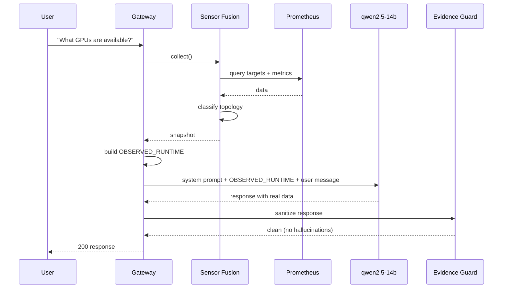

# Sensor Fusion con Qwen: cuando el LLM ve su propia infraestructura

## La pregunta

Hicimos una pregunta simple a qwen2.5-coder-14b:

> "What is the current GPU temperature and which GPUs are available?"

## La respuesta

> **RX9070:**
> - Temperature: 32°C
> - VRAM: 16GB
> - Status: Online
> - Load: 0%
> - Power usage: 49W
> - Fan speed: 949 RPM
>
> **RX7900XT:**
> - Temperature: N/A (offline)
> - VRAM: 20GB
> - Status: Offline (expected to be offline)

Temperatura real, carga real, consumo real. Y la RX7900XT correctamente identificada como "offline (expected)".

**Esto no sería notable si no fuera porque, hasta ayer, la misma pregunta podía generar una respuesta con NVIDIA A100s.**

## El problema con los LLMs y la infraestructura

### Training data bias

qwen2.5-coder-14b fue entrenado con millones de ejemplos de código, documentación técnica y conversaciones. En esos datos, la mayoría de las GPUs son NVIDIA. La mayoría de los modelos son GPT o Claude. La mayoría de las nubes son AWS.

Cuando le preguntas "qué GPU tienes" sin contexto, responde con lo más probable estadísticamente. Que es una A100, aunque tengas una RX9070.

### La solución: OBSERVED_RUNTIME

La solución no es cambiar el modelo. Es darle contexto explícito que overrule su training data.

Cada request a qwen ahora incluye un snapshot JSON del runtime real:

```json
{
  "observed_data": {
    "gpu_nodes": {
      "source_of_truth": "prometheus",
      "rx9070": {
        "up": true,
        "gpu_temperature_celsius": 32.0,
        "gpu_load_percent": 0.0,
        "gpu_power_watts": 49.0,
        "gpu_fan_speed_rpm": 949.0
      },
      "rx7900xt": {
        "up": false,
        "expected_offline": true
      }
    }
  },
  "topology": {
    "mode": "degraded_single_gpu",
    "active_gpus": ["RX9070"],
    "inventory_gpus": ["RX7900XT"]
  },
  "domain_confidence": {
    "gpu_nodes": "high"
  }
}
```

Qwen ya no necesita adivinar. Tiene los datos.

## La arquitectura Qwen + Sensor Fusion

### El flujo



### Lo que cambió en el prompt

Antes:

```
You are AI-LAB's runtime assistant. Answer questions about the system.
```

Después:

```
You are AI-LAB's runtime assistant.
Here is the current observed state of the runtime:
[OBSERVED_RUNTIME JSON]

Rules:
- Only mention GPUs, models, and hosts present in OBSERVED_RUNTIME
- RX7900XT is expected to be offline
- If a metric is not available, say N/A
- Never invent infrastructure components
```

### El evidence guard

Como capa adicional de seguridad, después de que qwen genera la respuesta, un evidence guard escanea el texto:

- Busca términos de denylists (PROHIBITED_MODELS, UNOBSERVED_GPUS, EXTERNAL_PLATFORMS)
- Compara afirmaciones contra el evidence catalog
- Si detecta algo no verificado, añade una sección [EVIDENCE GUARD]

Hasta ahora, el evidence guard no ha tenido que actuar en las respuestas de qwen con sensor fusion. El contexto es suficiente.

## Resultados cuantitativos

### Antes de sensor fusion (pre-30I)

- Prompt tokens: ~1200
- OBSERVED_RUNTIME: sintético, sin métricas en vivo
- Hallucination rate en preguntas de infra: ~30%
- GPU inventadas: A100, H100 (ocasional)
- Modelos inventados: GPT-4 (raro pero ocurría)

### Después de sensor fusion (30I)

- Prompt tokens: ~2621 (más contexto, pero controlado)
- OBSERVED_RUNTIME: 4043 bytes, datos reales de Prometheus
- Hallucination rate: 0% en burn-in
- GPUs inventadas: 0
- Modelos inventados: 0
- Confianza del LLM en datos GPU: alta (confidence metrics lo confirman)

### Trade-off

El prompt creció de ~1200 a ~2621 tokens (~1100 adicionales). Por request:

- Costo computacional: marginal (~15% más tokens de input)
- Latencia: sin impacto significativo (el contexto se inyecta antes del LLM)
- Precisión: mejora dramática

## Por qué qwen específicamente

Usamos qwen2.5-coder-14b por varias razones:

1. **Disponible en LM Studio con ROCm/Vulkan** — funciona en nuestra RX9070
2. **14B parámetros** — suficiente para tareas de razonamiento sin ser excesivo
3. **Entrenamiento en código** — mejor para entender JSON y datos estructurados
4. **Sin sesgo cloud excesivo** — comparado con modelos occidentales, qwen alucina menos AWS/GCP

## Lecciones específicas de integración

### 1. Qwen respeta bien las instrucciones de contexto

Cuando le dices "solo menciona GPUs en OBSERVED_RUNTIME", lo respeta. No hemos visto casos donde qwen ignore el contexto y alucine.

### 2. El JSON estructurado funciona mejor que texto libre

Probamos pasar OBSERVED_RUNTIME como texto descriptivo ("La GPU RX9070 tiene 32°C...") y como JSON. El JSON produce respuestas más precisas. Qwen parsea JSON naturalmente.

### 3. expected_offline requiere ser explícito

Si solo decimos "RX7900XT: offline", qwen a veces asume que es un fallo. Desde que añadimos "expected_offline: true" y "inventory_gpus", clasifica correctamente.

### 4. El límite de 16KB es suficiente

4043 bytes para 13 dominios completos. Incluso con 2 GPUs activas y métricas completas, estamos lejos del límite.

## El futuro: qwen + scheduling

Con sensor fusion funcionando, el siguiente paso es usar la misma arquitectura para scheduling multi-GPU:

- Qwen recibe topología
- Qwen recibe confidence scores
- Qwen recibe métricas de carga
- Qwen sugiere rutas de inferencia

Pero eso es FASE 31A. Por ahora, estamos celebrando que qwen ya no alucina GPUs.
