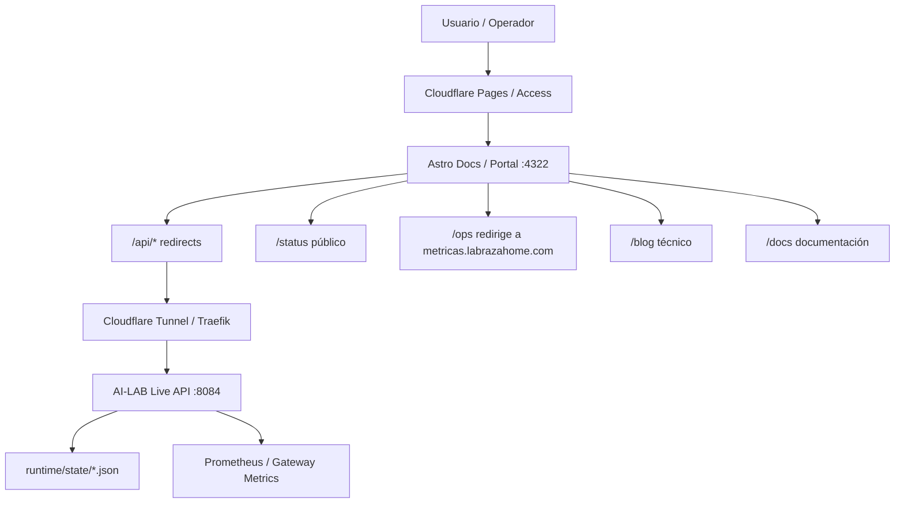

## 1. Resumen ejecutivo

Astro es la capa documental y visual de AI-LAB, separada del runtime crítico. Sirve documentación técnica, blog, paneles de estado público, portal privado de operaciones y visualización de telemetría agregada. No ejecuta lógica de inferencia ni modifica el runtime.

- **App**: `/opt/ai-lab/apps/ialab-docs`
- **Framework**: Astro 6.3.1 con Starlight, React 19, Tailwind CSS 4
- **Build**: `npm run build` → `dist/`
- **Serving**: `astro preview` mediante systemd (`ailab-docs.service`) en puerto 4322
- **URL pública**: `https://ai-lab.labrazahome.com`
- **URL privada**: `https://blog-ai-lab.labrazahome.com` (protegida con Cloudflare Access)

## 2. Objetivo de la capa Astro

- Documentación técnica del laboratorio (content collections)
- Blog privado/público (15 entradas)
- Paneles de estado ligeros (status hub, health score)
- Portal privado de operaciones
- Visualización de telemetría agregada
- Runbooks e incidentes documentados
- Mapa de nodos, GPUs, modelos y servicios

## 3. Estructura de la aplicación

```
src/pages/              → Rutas del sitio (cada .astro es una ruta)
src/components/         → Componentes reutilizables (.astro y .tsx/.jsx)
src/layouts/            → Layout principal
src/content/            → Content collections (blog, docs, runbooks, incidents)
  blog/                 → 15 entradas de blog en markdown
  docs/                 → Documentación técnica (arquitectura, runtime, ADRs, fases)
  runbooks/             → Runbooks operacionales
  incidents/            → Incidentes documentados
src/styles/             → CSS global
public/                 → Archivos estáticos (imágenes, _redirects, JSON de estado)
dist/                   → Build de salida
```

### Rutas reales encontradas

| Ruta | Tipo | Descripción |
|------|------|-------------|
| `/` | página | Home / landing |
| `/architecture/` | página | Arquitectura operacional (datos de API) |
| `/architecture/security/` | página | Seguridad |
| `/ai-infrastructure/` | página | Infraestructura AI (10 capas) |
| `/research/` | página | Research index |
| `/hardware-lab/` | página | Hardware lab |
| `/observability/` | página | Observabilidad |
| `/experiments/` | página | Experiments |
| `/projects/` | página | Proyectos técnicos |
| `/skills/` | página | Skills |
| `/blog/` | página + slug | Blog técnico (collection) |
| `/docs/` | página + slug | Documentación técnica (collection con Starlight sidebar) |
| `/runbooks/` | página + slug | Runbooks (collection) |
| `/status/` | página | Status hub con KPIs y health score |
| `/status/live/` | página | Estado vivo (redirect a métricas) |
| `/status/history/` | página | Histórico de telemetría (KPIs + health score + Recharts) |
| `/status/topology/` | página | Topología del cluster (ASCII + TopologyGraph) |
| `/status/gpus/` | página | Estado GPUs |
| `/status/models/` | página | Modelos |
| `/infra/` | página | Infrastructure inventory (datos de API) |
| `/portal/` | página | Portal privado de operaciones |
| `/ops/` | página | Operations Center (redirect a metricas.labrazahome.com/ops) |
| `/ops/commands/` | página | Comandos operacionales |
| `/ops/learning/` | página | Learning |
| `/ops/memory/` | página | Memory |
| `/services/` | página | Servicios |
| `/knowledge/` | página | Knowledge hub |
| `/incidents/` | página | Incidentes |
| `/models/` | página | Model registry |
| `/api/*.json` | API Route | Endpoints JSON internos de Astro |

### Content collections

Definidas en `src/content.config.ts`:

- **blog**: `src/content/blog/*.md` — title, date, summary, tags
- **docs**: `src/content/docs/**/*.md` — title, summary, order
- **runbooks**: `src/content/runbooks/*.md` — title, summary, severity

## 4. Separación público / privado

La seguridad no depende de Astro, sino de Cloudflare Access / routing / proxy delante de la app.

### Público (sin autenticación)

- `/` — landing
- `/status/`, `/status/history/`, `/status/topology/`, `/status/gpus/`, `/status/models/` — estado público con métricas agregadas (sin datos sensibles)
- `/blog/` y entradas (según configuración de Cloudflare)
- `/docs/` (según configuración)
- `/architecture/`, `/ai-infrastructure/`, `/research/`, `/hardware-lab/`, `/observability/`, `/experiments/`, `/projects/`, `/skills/`
- `/api/*.json` — datos agregados no sensibles

### Privado (protegido con Cloudflare Access)

- `/portal/*` — portal de operaciones
- `/ops/*` — operations center, commands, learning, memory
- `/services/` — servicios internos
- `/knowledge/` — knowledge hub
- `/incidents/` — incidentes
- `/models/` — model registry
- `/runbooks/` — runbooks

### Routing de seguridad

```
Cloudflare Pages (ai-lab.labrazahome.com) → público
Cloudflare Access + Tunnel (blog-ai-lab.labrazahome.com) → privado
  → Traefik reverse proxy
    → Astro dev/preview en :4322
```

## 5. Integración con AI-LAB Runtime

Astro consume datos del runtime a través de API routes internas que redirigen al Live API backend:

```
Astro frontend (navegador)
  → /api/status.json (proxy Astro → Cloudflare/Tunnel → Traefik)
    → AI-LAB Live API (:8084)
      → runtime/state/cluster_state.json
      → Prometheus / Gateway metrics
```

### Endpoints consumidos

| Endpoint Astro | Backend | Componentes que lo usan |
|---|---|---|
| `/api/status.json` | Live API :8084 | HomeLiveStats, LiveStatus, Status Hub, History |
| `/api/events` | Live API :8084 | EventStream (planificado) |
| `/api/topology` | Live API :8084 | TopologyGraph |
| `/api/history.json` | Live API :8084 | HistoryCharts.jsx |
| `/api/analytics.json` | Live API :8084 | Status Hub + History |
| `/api/infra.json` | Live API :8084 | Infra inventario |
| `/api/architecture.json` | Live API :8084 | Architecture page |
| `/api/models.json` | Live API :8084 | Models page |
| `/api/services.json` | Live API :8084 | Services page |
| `/api/knowledge.json` | Live API :8084 | Knowledge hub |
| `/api/incidents.json` | Live API :8084 | Incidents page |

### Flujo de datos

```
Navegador → fetch(/api/status.json)
  → Astro static build (no SSR) → archivo estático en dist/ o redirect
    → Cloudflare Pages _redirects
      → Cloudflare Tunnel
        → Traefik
          → Live API :8084
            → runtime/state/cluster_state.json
```

Nota: En modo `astro preview` local (systemd), las rutas `/api/*` se sirven desde `public/api/` si existen archivos JSON estáticos, o mediante la app separada de métricas (Next.js SSR en metricas.labrazahome.com).

## 6. Componentes principales

### Componentes .astro

| Componente | Archivo | Descripción | Estado |
|---|---|---|---|
| SidebarLink | `src/components/SidebarLink.astro` | Enlace de navegación con icono y detección de ruta activa | Activo |
| HomeLiveStats | `src/components/HomeLiveStats.astro` | KPIs de home (GPUs, LLM nodes, Docker, VRAM) con refresh cada 5s | Activo |
| LiveStatus | `src/components/LiveStatus.astro` | Barra de estado live con GPUs, LLM, containers | Activo |
| LiveStatusCard | `src/components/LiveStatusCard.astro` | Card individual de estado | Activo |
| StatusCard | `src/components/StatusCard.astro` | Card para status hub | Activo |
| TopologyGraph | `src/components/TopologyGraph.astro` | Topología ASCII del cluster con refresh cada 5s | Activo (ASCII, pendiente Cytoscape) |
| GpuBar | `src/components/GpuBar.astro` | Barra de GPU | Activo |
| OpsServiceCard | `src/components/OpsServiceCard.astro` | Card de servicio para ops | Activo |
| TerminalWidget | `src/components/TerminalWidget.astro` | Widget terminal | Activo |
| ClusterHealth | `src/components/ClusterHealth.astro` | Salud del cluster | Activo |
| EventStream | `src/components/EventStream.astro` | Stream de eventos SSE (planificado) | Pendiente |

### Componentes React (.tsx/.jsx)

| Componente | Archivo | Descripción | Estado |
|---|---|---|---|
| HistoryCharts | `src/components/HistoryCharts.jsx` | Gráficas históricas con Recharts (usage, VRAM) | Activo |

### Librerías de visualización

| Librería | Propósito | Estado |
|---|---|---|
| **Recharts** | Gráficas de histórico (HistoryCharts.jsx) | Instalado y activo |
| **Cytoscape.js** | Reemplazo planificado para topología gráfica interactiva | Instalado en package.json pero no implementado |
| **Mermaid** | Diagramas en documentación | Instalado y activo (astro-mermaid) |
| **Lucide** | Iconos en sidebar y componentes | Instalado y activo |
| **uPlot** | Gráficos ligeros para GPU live | No instalado (pendiente de fase anterior) |

## 7. Build y serving

### Build

```bash
cd /opt/ai-lab/apps/ialab-docs
npm run build
# → genera dist/ con 254 páginas estáticas
# → incluye sitemap, search index (Pagefind via Starlight)
# → _redirects copiado a dist/
```

### Serving

- **Producción**: `astro preview` en puerto `:4322` mediante systemd (`ailab-docs.service`)
- **Desarrollo**: `astro dev` con hot reload
- **Cloudflare Pages**: build automático en push a GitHub, despliegue en `ai-lab.labrazahome.com`
- **Separación público/privado**: Cloudflare Access + Tunnel para tráfico privado

### _redirects

El archivo `public/_redirects` controla el enrutamiento en Cloudflare Pages. Actualmente sin reglas definidas (vacío). Las redirecciones se gestionan desde Cloudflare Dashboard.

### Alternativa futura

Servir `dist/` con **nginx** para eliminar Node.js del serving path y maximizar rendimiento.

## 8. Seguridad

- No se exponen datos sensibles en rutas públicas
- `/ops/*` y `/portal/*` protegidos con Cloudflare Access
- `/status/*` público solo con métricas agregadas (sin IPs internas, sin tokens)
- Las API routes internas solo sirven datos agregados no sensibles
- La autenticación no depende de Astro sino de Cloudflare Access (Zero Trust)

## 9. Estado actual

| Área | Estado | Comentario |
|---|---|---|
| Astro app | Activo | `/opt/ai-lab/apps/ialab-docs`, Astro 6.3.1 |
| Build | OK | 254 páginas, ~12s |
| Status page | Activo | KPIs, health score, refresh 15s |
| Topology | Activo (ASCII) | Pendiente migración a Cytoscape |
| History page | Activo | Recharts + KPIs + health gauge |
| Ops dashboard | Redirigido | `ops/` redirige a metricas.labrazahome.com/ops |
| Portal | Activo | Hub de enlaces a herramientas |
| Cloudflare redirects | Vacío | `public/_redirects` sin reglas |
| Recharts | Activo | HistoryCharts.jsx funcional |
| Cytoscape | Instalado | En package.json, no implementado |
| uPlot | No instalado | Pendiente de fase anterior |
| Mermaid | Activo | Diagramas en content collections |
| Starlight search | Activo | Pagefind index integrado |
| Navegación (sidebar) | Activo | 15 enlaces + logo + runtime footer |

## 10. Decisiones arquitectónicas

1. **Astro static (SSG) en vez de SSR**: No necesita servidor Node para servir contenido. La build genera HTML estático. El contenido dinámico (KPIs, health) se carga via fetch client-side desde `/api/*`.
2. **Cloudflare Access para seguridad**: La autenticación no se implementa en Astro sino en el edge (Cloudflare Access + Tunnel). Astro no maneja sesiones ni tokens.
3. **Live API separada**: Los datos operativos no se sirven desde Astro SSR. Se sirven desde una app separada (Next.js en metricas.labrazahome.com) o desde la Live API (:8084).
4. **Starlight para documentación**: La sidebar de docs y el search vienen de Starlight, no implementados manualmente.
5. **React islands**: Solo donde se necesita interactividad (HistoryCharts con Recharts). El resto es Astro puro.
6. **Archivos JSON estáticos en public/**: Algunos endpoints `/api/*.json` se servían desde archivos estáticos. Ahora se sirven dinámicamente desde la app de métricas.

## 11. Roadmap recomendado

- [ ] Consolidar /dashboard unificado con estado vivo y health en una sola vista
- [ ] Migrar TopologyGraph de ASCII a Cytoscape.js (librería ya instalada)
- [ ] Implementar GpuLiveChart con uPlot para gráficos GPU en tiempo real
- [ ] Definir reglas en `public/_redirects` para enrutamiento Cloudflare Pages explícito
- [ ] Mejorar search/RAG interno sobre content collections
- [ ] Separar claramente blog público y portal privado en la navegación
- [ ] Servir dist/ con nginx como futuro hardening (eliminar Node.js del serving)

## 12. Diagrama de arquitectura


