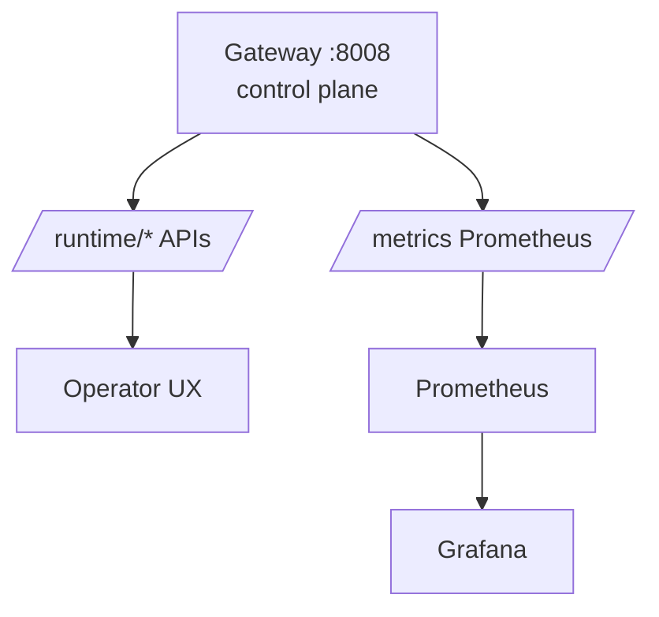

El control plane de AI-LAB vive en el **gateway** y se expone vía `/runtime/*`.

## Propiedades

- Endpoints **read-only**.
- Respuesta 200 incluso en degradación (payload `status=degraded`).
- Contratos con `contract_version`.

## Ejemplos de APIs

```text
GET /runtime/maturity
GET /runtime/sensors
GET /runtime/cognitive-summary
GET /runtime/observability/audit
GET /runtime/triage/summary
GET /runtime/graph/summary
```

## Diagrama: control plane


