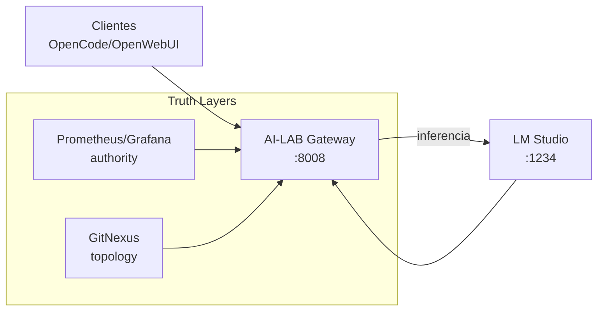

AI-LAB ya no es un “gateway LLM” ni una colección de contenedores. Es una plataforma **cognitiva operacional** con separación explícita de responsabilidades.

## Capas (source-of-truth por rol)

| Capa | Rol | Qué garantiza | Qué NO hace |
|---|---|---|---|
| LM Studio | Inferencia | Sirve modelos y API OpenAI-compatible (`/v1/*`) | No aplica governance, no decide routing |
| AI-LAB Gateway | Runtime + gobernanza | Routing determinista, perfiles, evidence/precision, federation guards, observabilidad + APIs runtime | No es el modelo, no “infiere” sin backend |
| GitNexus | Inteligencia topológica | Topología de imports, hotspots, blast radius, gravity centers | No mide runtime en vivo |
| Prometheus/Grafana | Autoridad observacional | Métricas, alertas y dashboards | No razona, no decide política |

## Endpoints canónicos

```text
LM Studio (inference backend)
http://192.168.1.50:1234/v1

AI-LAB Gateway (OpenAI-compatible + control plane)
http://192.168.1.30:8008/v1
```

## Diagrama: runtime cognitivo (alto nivel)



## Qué significa “cognitive runtime” aquí

- **Determinismo y boundedness**: el runtime decide rutas y políticas con reglas, no con “opinión del LLM”.
- **Evidence-bound**: si falta señal, se devuelve **NO DISPONIBLE** en vez de inventar.
- **Governance explícita**: acciones peligrosas se bloquean, se contabilizan y se explican.
- **Topología como señal**: GitNexus deja de ser UI y pasa a aportar *inteligencia estructural*.
