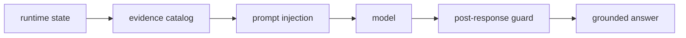

## Idea central

Un runtime evidence-bound no permite que el LLM defina su infraestructura por plausibilidad estadística.

## Capas

1. **Prompt discipline**
2. **OBSERVED_RUNTIME**
3. **Sensor semantics**
4. **Evidence catalog**
5. **Evidence guard**

## Flujo

## Qué evita

- GPUs inexistentes
- plataformas cloud no desplegadas
- modelos no activos
- hosts no observados
- confundir inventario con runtime vivo
