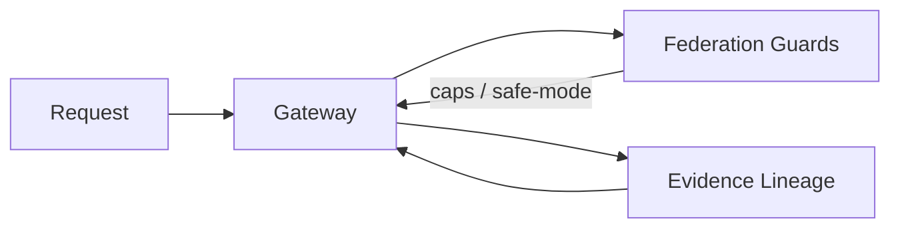

Federation en AI-LAB no es “multi-node por marketing”. Es disciplina de **trust boundaries**, evidencia y degradación segura.

## Componentes

- Federation guards: límites de contexto, storm detection, safe-mode.
- Evidence lineage: propagación y reutilización de evidencia.

## Endpoints

```text
GET /runtime/guards/summary
GET /runtime/guards/state
GET /runtime/guards/events

GET /runtime/evidence/summary
GET /runtime/evidence/hotspots
GET /runtime/evidence/lineage/<id>
```

## Diagrama: federation flow


