## Qué contiene

- **Runtime Observability Fabric** — tejido de observabilidad del runtime: Prometheus como sistema nervioso, sensor fusion, evidence pipeline y topología dinámica
- **Runtime Sensor Topology** — topología dinámica derivada de sensores Prometheus, clasificación de nodos GPU, modos de topología y transiciones
- **Runtime Evidence Pipeline** — pipeline completo de evidencia desde Prometheus hasta el LLM, con observed/derived separation, confidence scoring y sanitización

## Capas arquitectónicas

```mermaid
flowchart LR
    subgraph PHYSICAL[Physical Layer]
        P[Prometheus 192.168.1.40]
        L[LM Studio 192.168.1.50]
        G[Gateway 192.168.1.30]
    end
    
    subgraph ACQUISITION[Acquisition Layer]
        QC[PrometheusQueryClient]
        LC[LM Studio Client]
    end
    
    subgraph FUSION[Fusion Layer]
        SF[SensorFusionEngine]
        SB[OperationalSummaryBuilder]
    end
    
    subgraph COGNITIVE[Cognitive Layer]
        RR[OBSERVED_RUNTIME]
        EG[Evidence Guard]
        LLM[qwen2.5-14b]
    end
    
    PHYSICAL --> ACQUISITION
    ACQUISITION --> FUSION
    FUSION --> COGNITIVE
```

## Checkpoint actual

**CP-30I-RUNTIME-SENSOR-FUSION-STABLE** — sensor fusion runtime con arquitectura de 4 capas, 13 dominios, confidence per-domain.
