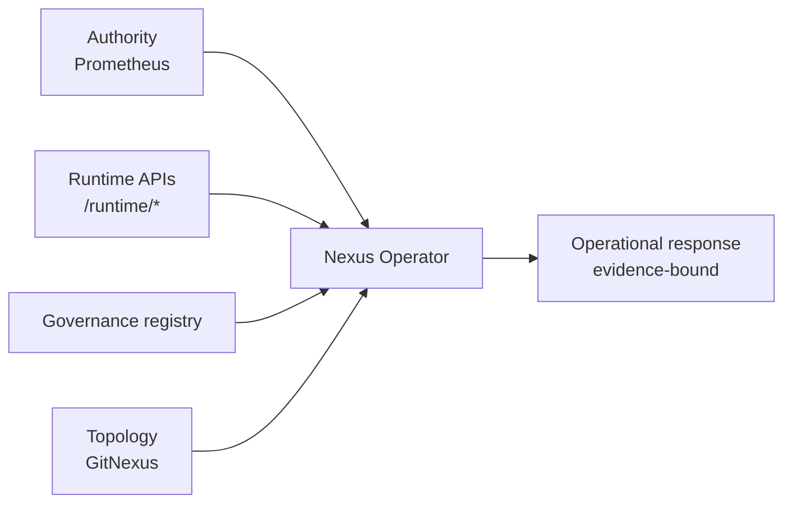

Esta página define el destino del “operador” de Nexus como **capa de inteligencia operacional** sobre el runtime.

## Principios (no negociables)

- Sin AGI claims.
- Sin auto-remediation por defecto.
- Sin loops autónomos, threads, polling agresivo.
- Determinista, bounded, explicable.
- Evidence-first: si no hay señal, es NO DISPONIBLE.

## Inputs (señales)

- **Authority**: Prometheus / health / freshness / gaps.
- **Runtime**: endpoints `/runtime/*` (SLO, triage, topology, observability audits).
- **Topology**: GitNexus graph reasoning (hotspots/blast-radius/gravity-centers).
- **Governance**: registry, drift y policy decisions.

## Outputs

- Diagnósticos operacionales compactos.
- Priorización por riesgo (blast radius + SLO + incidents).
- Recomendaciones **no destructivas** por defecto.

## Diagrama: operador de señales

