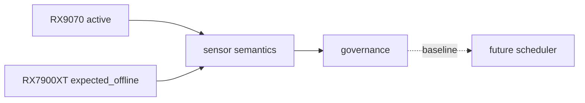

## Baseline

- RX9070 activa
- RX7900XT inventariada / expected_offline
- sensor semantics normalizadas
- evidence-bound reporting operativo
- storage archive governance activo

## Diagrama

## Qué significa

El runtime ya sabe distinguir:

- activo vs inventariado
- observado vs derivado
- fresh vs unavailable
- confidence crítica vs no crítica

Eso es el prerequisito para cualquier scheduler serio.
