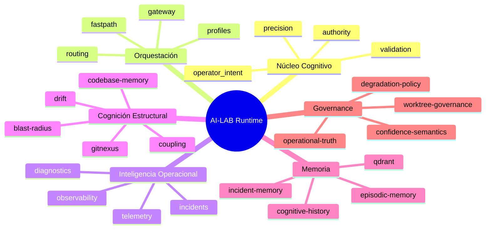

# AI-LAB Runtime Domains

Este documento realinea la arquitectura del runtime a sus **dominios reales** (bounded contexts) tras:

- ARCH-STABILIZATION-PASS-01
- 36A (operational incident intelligence)
- DEV-36X (codebase memory / GitNexus structural cognition)
- 36B (precision semantics)
- OBS-HF-LMSTUDIO-OPERATIONAL-TRUTH
- WORKTREE-GOVERNANCE-CLEANUP
- 36C (operator intent reasoning)

La intención aquí no es describir “un monolito gateway”, sino el runtime como **sistema gobernado por evidencia** con capas de verdad y dominios acoplados explícitamente.

## Núcleo Cognitivo

- `authority`: cognición respaldada por fuentes de autoridad (prometheus/observabilidad) y freshness.
- `validation`: invariantes y guardrails (grounding/evidence enforcement, contracts, safe defaults).
- `precision`: semántica de precisión operacional (partial evidence, conflicts, degradación segura).
- `operator_intent`: clasificación determinista de intención operativa como metadata (sin ejecución ni remediation autónoma).

## Runtime Orchestration

- `gateway`: único entrypoint OpenAI-compatible de chat (`:8008`) con inyección de contexto, routing determinista, streaming relay, rate-limit y sanitización.
- `routing`: clasificación de ruta-family (minimal/report/coding/tool_fastpath/etc.), escalación determinista y reasons.
- `profiles`: aplicación de perfiles y defaults (modelo/tokens/temp/tools/memory) via loader.
- `fastpath`: respuestas operacionales compactas (status, GPUs, observabilidad) basadas en evidencia.

## Operational Intelligence

- `incidents`: incident intelligence y señalización operacional.
- `observability`: sensor fusion, summaries, calidad de fuentes y estado derivado.
- `telemetry`: métricas y disciplina de observabilidad (prometheus + señales runtime).
- `diagnostics`: explicación operativa grounded (sin “inventar infraestructura”).

## Structural Cognition

- `GitNexus` (herramienta + pipeline): grafo estructural, riesgos, ownership, blast radius, drift.
- `codebase memory`: integración de signals estructurales en reporting/validation/incidents.
- `bounded contexts`: mapa emergente por rutas y dependencia; usado en review.

## Memory Layer

- `Qdrant`: retrieval semántico (colecciones gobernadas; ver docs de memoria).
- `episodic memory`: historial operacional (persistencia local; no versionado en git).
- `incident memory`: recall orientado a incidentes.
- `cognitive history`: trazas cognitivas agregadas.

## Governance Layer

- `runtime governance`: reglas de precedencia y límites de confianza.
- `operational truth`: separación active/loaded/discoverable/disabled + inventory.
- `confidence semantics`: confianza por dominio, freshness y gaps.
- `degradation policy`: degradación explícita y límites (sin auto-remediation).

## Diagrama: Arquitectura Runtime (Real)

```mermaid
flowchart TD
  U[Clientes: OpenCode / OpenWebUI] --> G[Gateway :8008\nopenai_gateway.py]

  subgraph ORCH[Runtime Orchestration]
    G --> R[Routing determinista\nroute_family + reasons]
    R --> P[Profiles\napply_profile()]
    R --> FP[FastPath 35D\noperational summaries]
    R --> OI[Operator Intent 36C\n_operator_intent metadata]
  end

  subgraph COG[Núcleo Cognitivo]
    A[Authority 35C]:::cog
    PR[Precision 36B]:::cog
    V[Validation / Evidence Guards]:::cog
  end

  subgraph TRUTH[Runtime Truth Layers]
    PROM[Prometheus (authority)]
    OT[OperationalTruth\n(sensor fusion, maturity, topology)]
    GN[GitNexus / Codebase Structural Truth]
  end

  G -->|inferencia| LM[LM Studio :1234\nRX9070]
  PROM --> OT
  OT --> FP
  GN --> OI
  GN --> OT
  classDef cog fill:#f4f6ff,stroke:#6b7cff,stroke-width:1px;
```

Notas:

- `gateway` integra metadata y aplica perfiles, pero **la autoridad** viene de Prometheus/OperationalTruth.
- GitNexus/structural cognition es **solo lectura** y no reemplaza autoridad.
- `operator_intent` es análisis determinista: no ejecuta, no autoriza, no muta infra.

## Diagrama: Bounded Contexts Map


