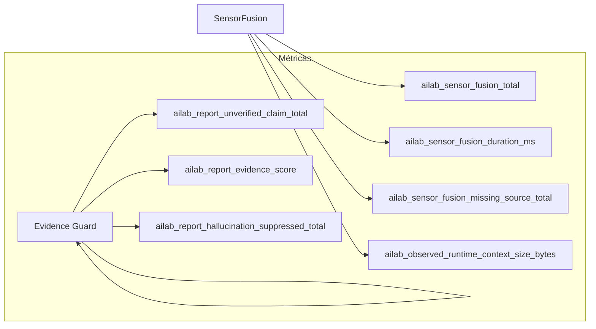

## Pipeline completo

```
Prometheus API  ─┐
LM Studio API   ─┤
                  ├── SensorFusionEngine ──→ RuntimeSensorFusionSnapshot
Gateway state   ─┘                              │
                                          ┌─────┴──────┐
                                          │            │
                                     observed     derived
                                     data         state
                                          │            │
                                          └─────┬──────┘
                                                │
                                     domain_confidence
                                                │
                                     evidence_catalog
                                                │
                                     OperationalSummary
                                                │
                                     OBSERVED_RUNTIME (≤16KB)
                                                │
                                     LLM (qwen2.5-14b)
                                                │
                                     Evidence Guard (post-hoc)
                                                │
                                     Response al cliente
```

## Etapa 1: Adquisición

### PrometheusQueryClient

```python
class PrometheusQueryClient:
    def query_instant(self, query: str) -> float | None
    def get_target_up(self, job: str) -> dict
    def query_gpu_metrics(self, host: str) -> dict
    def get_freshness(self, source: str) -> float
```

- Timeout: 2s por query
- Cache: TTL 5s por source
- Fallback: None (nunca lanza excepción)
- GPU detection: dinámica desde target labels

### LM Studio API

```python
class LmStudioClient:
    def get_models(self) -> list[dict]
```

- Endpoint: `GET /v1/models`
- Timeout: 3s
- Fallback: lista vacía + freshness label

## Etapa 2: Fusión

### SensorFusionEngine

```python
class SensorFusionEngine:
    def collect(self) -> RuntimeSensorFusionSnapshot
```

El método `collect()`:

1. Consulta Prometheus para cada uno de los 13 dominios
2. Clasifica targets UP/DOWN
3. Descubre métricas GPU dinámicamente
4. Obtiene modelos de LM Studio
5. Separa observed_data de derived_state
6. Calcula domain_confidence per-domain
7. Clasifica topología
8. Construye evidence_catalog

### RuntimeSensorFusionSnapshot

```python
@dataclass
class RuntimeSensorFusionSnapshot:
    observed_data: dict              # Datos crudos por dominio
    derived_state: dict              # Inferencias del runtime
    domain_confidence: dict          # Confidence por dominio
    topology: RuntimeTopologyState   # Topología derivada
    evidence_catalog: dict           # Catálogo de evidencia
    observed_sources: list[str]      # Fuentes observadas
    missing_sources: list[str]       # Fuentes no disponibles
    expected_offline_targets: list[dict]  # Targets offline esperados
    unexpected_down_targets: list[dict]   # Targets caídos inesperados
    last_scrape_seconds_ago: dict[str, float]  # Freshness labels
```

## Etapa 3: Resumen

### OperationalSummaryBuilder

Construye resúmenes route-family-aware. Cada ruta recibe solo la información que necesita:

| Ruta | GPU | Routing | SLO | Storage | Identity |
|------|-----|---------|-----|---------|----------|
| minimal | ✅ | ❌ | ❌ | ❌ | ❌ |
| report | ✅ | ✅ | ✅ | ✅ | ✅ |
| cognitive | ✅ | ✅ | ✅ | ❌ | ✅ |

Ejemplo de summary para ruta report:

```
=== GPU ===
RX9070: 16GB VRAM, 0% load, 32°C, 49W, fan 950RPM
RX7900XT: 20GB VRAM, offline (inventory)

=== ROUTING ===
Mode: stream-aware sanitized
Default: qwen2.5-coder-14b-instruct
Greeting fastpath: llama-3.1-8b-instruct
Route tightening: active (29.3.1)

=== SLO ===
State: GREEN, Degradation: NORMAL
TTFB p50: 804ms, Success: 99.2%

=== STORAGE ===
Snapshots: /opt/ai-lab/runtime/state/

=== IDENTITY ===
Runtime: ai-lab-openai-gateway
Host: ubuntu-ialab (192.168.1.30)
Prometheus: 192.168.1.40:9090
Inference: 192.168.1.50:1234
```

## Etapa 4: Inyección

### OBSERVED_RUNTIME

El snapshot se inyecta en el system prompt del LLM como JSON. Límite: 16 KB.

```json
{
  "observed_data": { "...": "..." },
  "derived_state": { "...": "..." },
  "domain_confidence": { "...": "..." },
  "runtime_topology": { "...": "..." },
  "evidence_catalog": { "...": "..." },
  "operational_summary": { "...": "..." }
}
```

## Etapa 5: Sanitización

### Evidence Guard (FASE 30H)

Post-hoc scanning de la respuesta del LLM contra el evidence_catalog:

1. Detecta afirmaciones no verificadas
2. Compara contra denylists (PROHIBITED_MODELS, UNOBSERVED_GPUS, etc.)
3. Calcula hallucination_risk score
4. Añade [EVIDENCE GUARD] section si es necesario

## Métricas del pipeline



## Ver también

- [FASE 30I — Runtime Sensor Fusion](/docs/runtime/30i-runtime-sensor-fusion/)
- [Runtime Observability Fabric](/docs/architecture/runtime-observability-fabric/)
- [Evidence Enforcement (FASE 30H)](/docs/governance/evidence-enforcement/)
- [Runtime Trust Boundaries](/docs/governance/runtime-trust-boundaries/)
