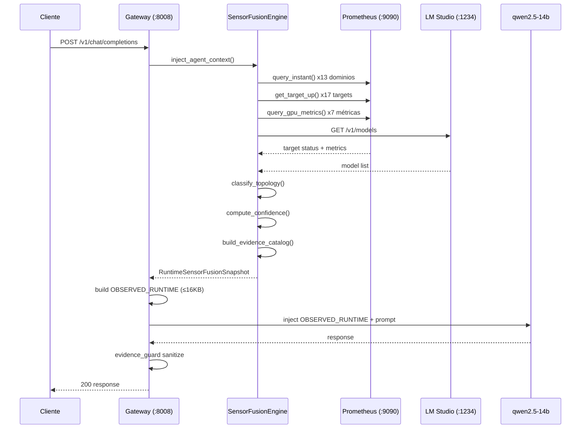
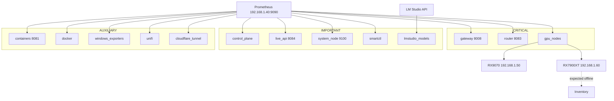

## Visión

La Runtime Observability Fabric es la capa arquitectónica que conecta la infraestructura física (GPUs, servidores, redes) con la cognición del LLM. No es un dashboard: es el sistema nervioso del runtime.

```
Infraestructura → Prometheus → Sensor Fusion → OBSERVED_RUNTIME → LLM
```

## Principios de diseño

### 1. Prometheus como source of truth único

Todo lo que el runtime sabe de sí mismo viene de Prometheus. No hay archivos de configuración duplicados, no hay defaults hardcoded, no hay heurísticas.

### 2. observed vs derived separation

Los datos crudos (observed_data) y las inferencias (derived_state) viven en espacios separados. El LLM puede ver ambos, pero el runtime sabe cuál es cuál.

### 3. Confidence per-domain

Un fallo en un sensor AUXILIAR no degrada la confianza de un sensor CRITICAL. El confidence scoring es granular.

### 4. Freshness sobre disponibilidad

Prefiero un dato stale etiquetado como tal que un dato "actual" que en realidad es un default sintético.

### 5. Cache con límite de daño

TTL de 5s con timeout de 2s para Prometheus. Si Prometheus no responde, el runtime usa el último dato conocido con freshness label. Nunca bloquea una request.

## Arquitectura en capas

```
┌─────────────────────────────────────────────────────┐
│                   CAPA COGNITIVA                      │
│  LLM (qwen2.5-14b) recibe OBSERVED_RUNTIME          │
│  Evidence guard sanitiza respuesta                   │
└──────────────────────┬──────────────────────────────┘
                       │
┌──────────────────────┴──────────────────────────────┐
│               CAPA DE FUSIÓN                          │
│  SensorFusionEngine                                  │
│  ├── collect(): 13 dominios                          │
│  ├── observed vs derived                             │
│  ├── domain confidence                               │
│  └── topology derivation                             │
│                                                       │
│  OperationalSummaryBuilder                           │
│  ├── route-family-aware                              │
│  └── gpu_summary, routing, slo, storage              │
└──────────────────────┬──────────────────────────────┘
                       │
┌──────────────────────┴──────────────────────────────┐
│               CAPA DE ADQUISICIÓN                     │
│  PrometheusQueryClient                               │
│  ├── query_instant()                                 │
│  ├── get_target_up()                                 │
│  ├── gpu_metrics() → dynamic discovery               │
│  ├── cache TTL 5s                                    │
│  └── timeout 2s                                      │
│                                                       │
│  LM Studio API Client                                │
│  └── /v1/models → model availability                 │
└──────────────────────┬──────────────────────────────┘
                       │
┌──────────────────────┴──────────────────────────────┐
│               CAPA FÍSICA                             │
│  Prometheus 192.168.1.40:9090                        │
│  ├── 17 targets                                      │
│  ├── 15 UP                                           │
│  ├── 2 DOWN (expected)                               │
│  └── 100+ métricas ailab_*                           │
│                                                       │
│  LM Studio 192.168.1.50:1234                         │
│  └── 3 modelos activos                               │
└─────────────────────────────────────────────────────┘
```

## Flujo completo de una request



## Mapa de dominios y dependencias



## Evolución de la arquitectura

```
FASE 29 (SLO enforcement)
├── Observabilidad reactiva
├── Métricas de rendimiento
└── Alertas de degradación

FASE 30H (Evidence enforcement)
├── Catálogo de evidencia sintético
├── Denylists y sanitización
└── NO DISPONIBLE para no observado

FASE 30I (Sensor fusion) ← ESTAMOS AQUÍ
├── Prometheus como source of truth
├── 13 dominios observados
├── Confidence per-domain
├── Topología dinámica
└── GPU metrics en vivo

FASE 31A (Multi-GPU)
├── Scheduler sensor-aware
├── Warm pool basado en métricas
└── Routing con confidence scores
```

## Ver también

- [Runtime Sensor Topology](/docs/architecture/runtime-sensor-topology/)
- [Runtime Evidence Pipeline](/docs/architecture/runtime-evidence-pipeline/)
- [FASE 30I — Runtime Sensor Fusion](/docs/runtime/30i-runtime-sensor-fusion/)
- [Prometheus Runtime Integration](/docs/observability/prometheus-runtime-integration/)
