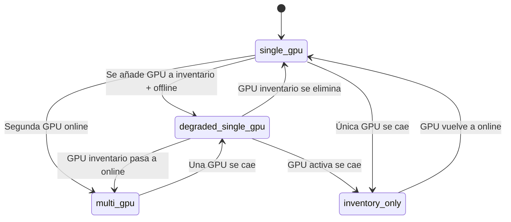

## De topología estática a dinámica

Antes de FASE 30I, la topología del runtime era un archivo JSON que había que mantener manualmente. Si un nodo cambiaba de IP, se caía o se añadía, alguien tenía que editarlo.

Ahora la topología se deriva de los targets de Prometheus. El runtime sabe qué nodos están UP, cuáles están DOWN, y cuáles están esperados offline.

## Modos de topología

### single_gpu

Un nodo GPU activo, todos los targets UP.

```
Gateway: UP
RX9070 (192.168.1.50): UP
RX7900XT (192.168.1.60): no configurado o no existe
```

### degraded_single_gpu (estado actual)

Un nodo GPU activo, uno o más nodos GPU en inventario con expected_offline.

```
Gateway: UP
RX9070 (192.168.1.50): UP
RX7900XT (192.168.1.60): DOWN (expected_offline: true)
```

### inventory_only

Sin GPUs activas. Todos los nodos GPU están en inventario (offline).

```
Gateway: UP
RX9070: DOWN (expected_offline: true)
RX7900XT: DOWN (expected_offline: true)
```

### multi_gpu (futuro, FASE 31A)

Dos o más nodos GPU activos simultáneamente.

```
Gateway: UP
RX9070 (192.168.1.50): UP
RX7900XT (192.168.1.60): UP
```

## Clasificación de GPUs

### Criterios

| Estado | Definición | Ejemplo |
|--------|-----------|---------|
| online | Target UP en Prometheus, métricas disponibles | RX9070 en 192.168.1.50 |
| offline | Target DOWN | RX7900XT en 192.168.1.60 |
| expected_offline | Target DOWN + marcado como inventory | RX7900XT (nodo apagado intencionalmente) |
| unexpected_down | Target DOWN + no marcado como inventory | GPU que se cayó sin razón conocida |

### Inventario vs activo

Las GPUs en inventario son conocidas pero no activas. Forman parte del `inventory_gpus` en el snapshot de topología. No se consideran un fallo.

Las GPUs activas están en `active_gpus` y deben tener targets UP.

## Transiciones de topología



### Anti-flapping

Las transiciones de topología tienen protección anti-flapping: no se cambia de modo si la transición anterior ocurrió hace menos de 30s.

## Componentes de la topología

### RuntimeTopologyState

```python
class RuntimeTopologyState:
    mode: str              # single_gpu | degraded_single_gpu | inventory_only | multi_gpu
    active_gpus: list[dict]     # GPUs online con métricas
    inventory_gpus: list[dict]  # GPUs offline conocidas
    unexpected_down: list[dict] # GPUs caídas inesperadamente
```

### GPU node schema

```json
{
  "name": "RX9070",
  "host": "192.168.1.50",
  "vram_gb": 16,
  "status": "online",
  "expected_offline": false,
  "gpu_temp_c": 32.0,
  "gpu_load_pct": 0.0,
  "gpu_power_w": 49.0,
  "gpu_fan_rpm": 950.0
}
```

## Integración con SLO degradation

La topología alimenta al `DegradationManager`:

| Topology mode | Degradation level |
|---------------|-------------------|
| single_gpu | NORMAL (0) |
| degraded_single_gpu | LIGHT (1) — forced llama + qwen protection |
| inventory_only | HEAVY (2) — bloqueo rutas pesadas |
| multi_gpu | NORMAL (0) — routing completo |

## Mapa de red actual

```
192.168.1.0/24
├── .30 (ubuntu-ialab)
│   ├── Gateway: 8008
│   ├── Router: 8083
│   ├── Live API: 8084
│   ├── Docs: 4322
│   └── Metrics: 3010
├── .40 (monitoring)
│   ├── Prometheus: 9090
│   └── Grafana: 3000
├── .50 (inference-node-1)
│   ├── LM Studio: 1234
│   ├── GPU exporter: 9182
│   └── GPU metrics: 9183
│   └── GPU: RX9070 16GB
└── .60 (inference-node-2) [OFFLINE]
    ├── GPU exporter: 9182
    ├── GPU metrics: 9183
    └── GPU: RX7900XT 20GB
```

## Ver también

- [FASE 30I — Runtime Sensor Fusion](/docs/runtime/30i-runtime-sensor-fusion/)
- [Runtime Observability Fabric](/docs/architecture/runtime-observability-fabric/)
- [Runtime Evidence Pipeline](/docs/architecture/runtime-evidence-pipeline/)
- [Prometheus Runtime Integration](/docs/observability/prometheus-runtime-integration/)
