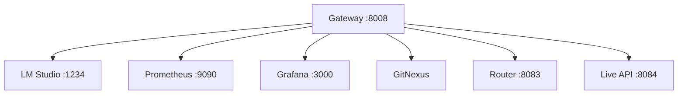

AI-LAB expone topología como señal operacional (no como diagrama estático).

## Endpoints

```text
GET /runtime/topology
GET /runtime/topology/dependencies
GET /runtime/topology/authority
GET /runtime/topology/blast-radius
GET /runtime/topology/confidence
GET /runtime/topology/drift
```

## Semántica clave

- **active**: componente operando ahora.
- **inventory**: existe pero no está en operación.
- **discoverable**: visible por discovery, no necesariamente operativo.

## Diagrama: topología runtime


