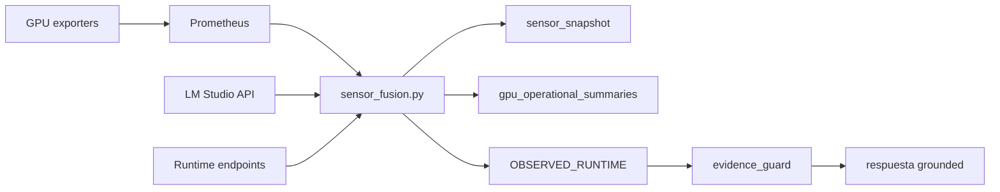

## Pipeline

## Etapas

1. adquisición de señales
2. normalización por dominio
3. derivación de topología
4. cálculo de confidence
5. construcción de summaries compactos
6. inyección en `OBSERVED_RUNTIME`
7. sanitización post-respuesta

## Resultado

Un contrato operacional reusable por:

- `/runtime/sensors`
- `OBSERVED_RUNTIME`
- evidence guard
- respuestas cortas GPU
