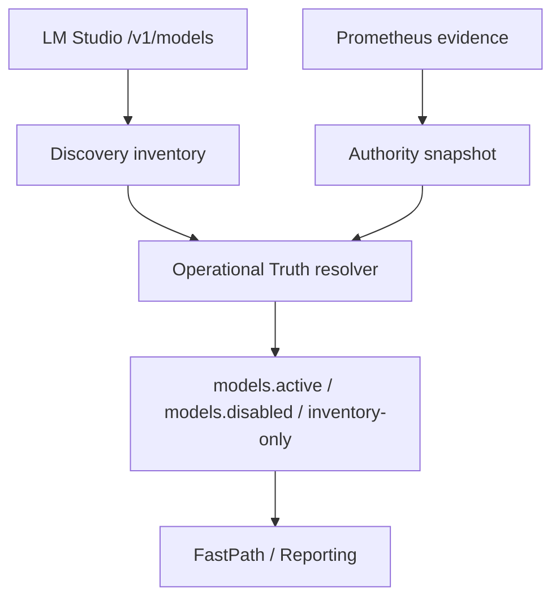

AI-LAB distingue explícitamente:

- **active**: modelo operativo en uso
- **loaded**: cargado en backend
- **discoverable**: aparece en inventario/listado, pero no implica uso
- **disabled**: prohibido/retirado del routing

La regla: **discoverable no se trata como operational**.

## Pipeline

## Riesgos evitados

- “ctx:0” o modelos de inventario reportados como operacionales.
- Confundir “aparece en /models” con “está routable”.

## Señales

- Fastpath debe declarar explícitamente `Discoverable: N (not operational)` cuando aplica.
