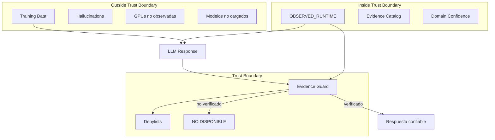
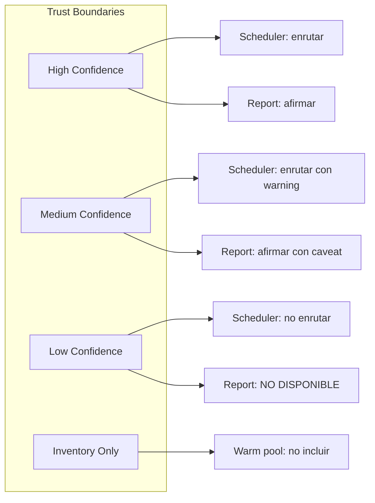

## El problema de la confianza

Un LLM no distingue entre "esto es verdad" y "esto es plausible". Para un runtime que debe reportar su estado con precisión, esa distinción es crítica.

Las trust boundaries definen:

- Qué dominios puede afirmar el LLM basado en evidencia
- Qué dominios están fuera de su conocimiento
- Cómo se degrada la confianza cuando falta evidencia
- Qué pasa cuando un sensor CRITICAL no responde

## Las tres fronteras



### Frontera 1: Observado vs no observado

La primera trust boundary separa lo que el runtime ha observado de lo que no.

**Dentro (puede afirmar con confianza):**
- GPUs cuyos targets Prometheus están UP
- Modelos confirmados por LM Studio API
- Servicios con health check OK
- Métricas scrapeadas en los últimos 5s

**Fuera (NO DISPONIBLE):**
- GPUs no configuradas en Prometheus
- Modelos no listados por LM Studio
- Servicios no monitoreados
- Métricas sin scrape reciente

### Frontera 2: Confidence per-domain

La segunda trust boundary es granular por dominio. El confidence de un dominio CRITICAL no se ve afectado por un dominio AUXILIARY.

| Dominio | Confidence si UP | Confidence si DOWN (expected) | Confidence si DOWN (unexpected) |
|---------|-----------------|------------------------------|--------------------------------|
| gateway (CRITICAL) | high | N/A | low |
| router (CRITICAL) | high | N/A | low |
| gpu_nodes (CRITICAL) | high | medium | low |
| system_node (IMPORTANT) | high | N/A | medium |
| unifi (AUXILIARY) | high | N/A | high (no afecta) |

### Frontera 3: Evidence Guard

La tercera trust boundary es el evidence guard post-hoc. Incluso si el LLM genera una afirmación fuera de la trust boundary, el guard la detecta y la marca.

```python
# Regla: si no está en evidence_catalog, no se afirma
def sanitize_unverified_claims(text, evidence_catalog):
    for claim in extract_claims(text):
        if claim not in evidence_catalog:
            mark_unverified(claim)
    if unverified_claims > MAX_UNVERIFIED_CLAIMS:
        append_evidence_guard_section(text, unverified_claims)
```

## La jerarquía de confianza

```
MÁXIMA CONFIANZA
├── observed_data con freshness < 5s
│   └── Ej: GPU temperature scrapeada hace 2s
├── derived_state con multiple confirmación
│   └── Ej: topology mode = degraded_single_gpu (2+ fuentes)
├── observed_data con freshness 5-30s
│   └── Ej: modelo confirmado hace 10s
├── derived_state con fuente única
│   └── Ej: health score basado en 1 métrica
├── expected_offline confirmado
│   └── Ej: RX7900XT en inventario
└── NO DISPONIBLE
    └── Sin datos de ninguna fuente
MÍNIMA CONFIANZA
```

## Trust boundaries y operaciones

### Impacto de un sensor CRITICAL caído

Si `gateway` (CRITICAL) está DOWN:
- El runtime no puede afirmar nada sobre el estado del gateway
- `derived_state.gateway.health = "unknown"`
- Las rutas de chat pueden degradarse
- El LLM ve `NO DISPONIBLE` para preguntas sobre el gateway

### Impacto de un sensor AUXILIARY caído

Si `unifi` (AUXILIARY) está DOWN:
- El runtime simplemente no incluye datos de red WiFi
- `domain_confidence.unifi = "none"`
- Ningún otro dominio se ve afectado
- El LLM no puede responder preguntas sobre estado de red

### expected_offline vs unexpected_down

`expected_offline` es una trust boundary deliberada: el runtime sabe que el nodo existe pero espera que esté apagado. No es un fallo.

`unexpected_down` es una violación de trust boundary: el runtime esperaba que el nodo estuviera UP pero no lo está.

## Trust boundaries y Multi-GPU

Para Multi-GPU (FASE 31A), las trust boundaries definen:

1. **Scheduling decisions**: un scheduler no debe enrutar a un nodo con confidence low
2. **Warm pool**: solo nodos con high confidence entran en warm pool
3. **Failover**: un nodo unexpected_down activa failover inmediato
4. **Capacity planning**: inventory GPUs (expected_offline) no cuentan para capacidad disponible



## Reglas

```
RULE-TRUST-1: Un dominio CRITICAL caído no degrada dominios IMPORTANT o AUXILIARY
RULE-TRUST-2: expected_offline no es un fallo de confianza
RULE-TRUST-3: unexpected_down requiere intervención humana
RULE-TRUST-4: confidence per-domain, no global
RULE-TRUST-5: freshness < 5s = high, 5-30s = medium, >30s = low
RULE-TRUST-6: El evidence guard es la última frontera (post-hoc)
```

## Métricas de trust

| Métrica | Descripción |
|---------|-------------|
| `ailab_sensor_fusion_total` | Colecciones ejecutadas |
| `ailab_sensor_fusion_missing_source_total` | Sources missing (violación de trust boundary) |
| `ailab_report_unverified_claim_total` | Afirmaciones no verificadas detectadas |
| `ailab_report_hallucination_suppressed_total` | Alucinaciones suprimidas |

## Ver también

- [Evidence Enforcement (FASE 30H)](/docs/governance/evidence-enforcement/)
- [FASE 30I — Runtime Sensor Fusion](/docs/runtime/30i-runtime-sensor-fusion/)
- [Runtime Observability Fabric](/docs/architecture/runtime-observability-fabric/)
- [Runtime Evidence Pipeline](/docs/architecture/runtime-evidence-pipeline/)
