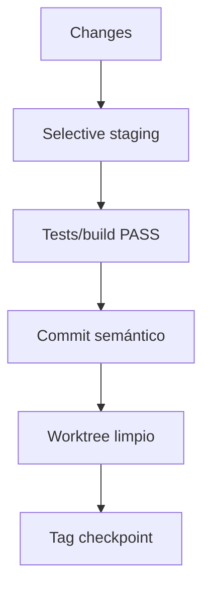

La trazabilidad git es parte de la gobernanza del runtime.

## Reglas

- **Nunca** commitear `runtime/state/*` (estado vivo operacional).
- Staging selectivo: separar runtime/docs/tooling.
- No crear tags/checkpoints con worktree sucio.

## Por qué `runtime/state/*` no va a git

- Contiene estado vivo (episodic memory, discovered nodes, cluster snapshot).
- Cambia por operación normal.
- Introduce ruido y puede filtrar información operativa.

## Pipeline de release (resumen)

## Referencia

Ver `WORKTREE_GOVERNANCE.md` en el repo runtime para las reglas completas.
