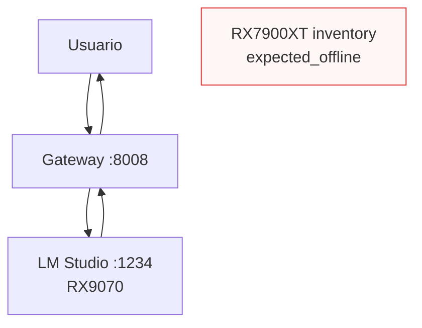

AI-LAB está diseñado para soportar inferencia distribuida entre múltiples nodos GPU, pero el estado actual es **stabilization-first**.

Objetivos:

- escalar capacidad
- distribuir carga
- optimizar VRAM
- mejorar reasoning
- aumentar resiliencia

---

# Nodos (estado actual)

| Nodo | GPU | Rol |
|---|---|---|
| 192.168.1.30 | — | Control plane (gateway/router/live-api/docs/metrics) |
| 192.168.1.50 | RX9070 | Backend de inferencia **activo** (LM Studio :1234) |
| 192.168.1.60 | RX7900XT | Backend **inventariado** (expected_offline) |

---

# Arquitectura (real, hoy)

## Multi-GPU (futuro)

Multi-GPU no se considera inmediato. Requiere:

- semantic stabilization
- authority hardening
- precision semantics
- burn-in
- memory maturity
- contracts de scheduler/placement
