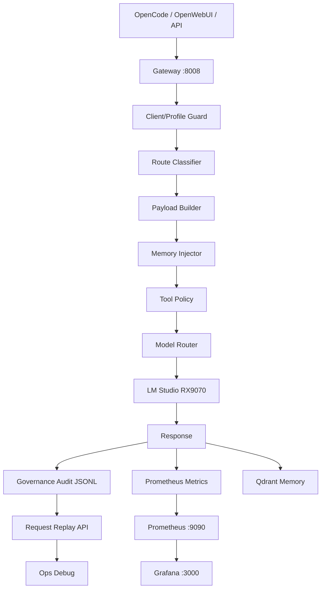

## Diagrama de flujo de observabilidad



---

## Infraestructura

| Componente | Host | Puerto | Estado |
|-----------|------|--------|--------|
| **Prometheus** | 192.168.1.40 | 9090 | Active |
| **Grafana** | 192.168.1.40 | 3000 | Active |
| **Router métricas** | 192.168.1.30 | 8083 | Active |
| **Gateway métricas** | 192.168.1.30 | 8008 | Active |
| **LM Studio** | 192.168.1.50 | 1234 | Active (RX9070) |

---

## Dashboards — TIER 1 (Operación diaria)

| # | Dashboard | UID | Descripción |
|---|-----------|-----|-------------|
| 00 | **Executive Overview** | `ai-lab-overview` | Salud general, burn-in mode, route dominance, contamination |
| 01 | **Routing & Models** | `ai-lab-runtime` | Rutas, latencia, tokens, modelos seleccionados |
| 02 | **Cognitive Profiles** | `ai-lab-profiles` | Distribución de perfiles, modelo por perfil |
| 03 | **Tool Governance** | `ai-lab-tools` | Tools bloqueadas, 428 gate, question stripped, bash sanitizer |
| 04 | **Memory Runtime** | `ai-lab-memory` | Recall, skip reasons, contamination, hard caps, quality score |
| 05 | **Route Family Observability** | `ai-lab-route-family` | Latencia p95/p99, errores, prompt tokens por familia |
| 06 | **Incidents & Audit** | `ai-lab-incidents` | Bloqueos, governance, fallback loops |
| 07 | **Request Traceability** | `ai-lab-traceability` | Replay API guide, drift signals, errors |

## Dashboards — TIER 2 (Troubleshooting)

| Dashboard | UID | Uso |
|-----------|-----|-----|
| AI-LAB Execution & Safety | `ai-lab-safety` | Seguridad y bloqueos detallados |
| AI-LAB GPUs | `ai-lab-gpus` | VRAM, temperatura, uso GPU |
| AI-LAB Infrastructure | `ai-lab-infra` | Docker, host, red |
| AI-LAB Production Burn-In | `ai-lab-burnin` | Burn-in dashboard (temporal) |

---

## Métricas Prometheus (todas)

### Perfiles cognitivos
```
ailab_profile_total{profile, route_family, model}
```

### Tool governance
```
ailab_tool_call_total{tool_name, result, policy, mode}
ailab_tool_fastpath_total
ailab_tool_fastpath_fallback_total
ailab_tool_calls_malformed_total
ailab_tool_empty_arguments_total
ailab_tool_question_stripped_total
ailab_confirmation_required_total
```

### Memory runtime
```
ailab_memory_recall_total{policy, hit}
ailab_memory_chars_injected{policy}           (histogram)
ailab_memory_items_total{policy, source}
ailab_memory_contamination_risk{policy}       (histogram)
ailab_memory_quality_score{policy}            (histogram)
ailab_context_cap_exceeded_total{policy}
```

### Routing
```
ailab_route_family_total{family}
ailab_route_family_latency_ms{family}         (histogram)
ailab_route_family_prompt_tokens_total{family}
ailab_route_family_completion_tokens_total{family}
ailab_route_family_errors_total{family}
ailab_route_family_blocked_total{family}
```

### Governance
```
ailab_governance_blocked_actions_total
ailab_governance_blocked_actions_by_reason_total{reason}
```

---

## Alertas Prometheus (18 reglas)

| Alerta | Severidad | Detecta |
|--------|-----------|---------|
| `MinimalRouteRegression` | warning | Contexto pesado en ruta ligera |
| `ToolFastpathLatencySpike` | critical | Fastpath roto |
| `CognitiveRouteExplosion` | warning | Recall runaway |
| `RouteFamilyErrorRate` | critical | Errores recientes |
| `GovernanceBlocksSpike` | warning | Abuso de prompts/tools |
| `ProfileUnknown` | warning | Perfil no clasificado |
| `ToolBudgetExceeded` | warning | Tools bloqueadas por politica |
| `MemoryFallback` | warning | Memory injector fallando |
| `MemoryActivatedInMinimal` | critical | Fuga de memoria en minimal |
| `MemoryCharsOverBudget` | warning | Light policy excediendo budget |
| `MemoryContaminationHigh` | warning | Contaminacion alta en recall |
| `MemoryHitRatioLow` | warning | Bajo ratio de hits |
| `QuestionToolLeakage` | critical | Question tool detectada |
| `EmptyArgumentsSpike` | warning | Bash tools sin argumentos |
| `ConfirmationRequired` | info | 428 gate activado |
| `MinimalRouteDominance` | warning | Minimal perdiendo dominancia |
| `ToolFastpathLeakage` | warning | Tool fastpath inesperado |
| `ContextCapExceeded` | warning | Hard cap excedido |

---

## Replay y Analytics API

```bash
# Full request replay
curl http://192.168.1.30:8083/api/request/replay/{request_id}

# Timeline estructurada
curl http://192.168.1.30:8083/api/request/flow/{request_id}

# Drift analytics
curl http://192.168.1.30:8083/api/analytics/drift

# Recall ROI
curl http://192.168.1.30:8083/api/analytics/recall-roi

# Memory replay
curl http://192.168.1.30:8083/api/memory/replay?limit=10
```

---

## Provisioning

Los dashboards se cargan desde:

```
/home/albert/docker/monitorizacion/grafana/provisioning/dashboards/AI-LAB/
```

Reload sin reiniciar:

```bash
docker exec grafana kill -HUP 1
```

Alertas:

```
/home/albert/docker/monitorizacion/prometheus/config/rules/ai-lab-route-family-alerts.yml
```

---

## Burn-In Mode (FASE 26.1)

- **Nodo único:** RX9070 (192.168.1.50:1234)
- **Scheduler multi-GPU:** OFF
- **Duración:** 48-72h
- **Dashboards:** Executive Overview + Burn-In + Route Family

---

## URLs

- **Grafana:** `http://192.168.1.40:3000` (admin / 19682507)
- **Prometheus:** `http://192.168.1.40:9090`
- **Router métricas:** `http://192.168.1.30:8083/metrics`
- **Gateway métricas:** `http://192.168.1.30:8008/metrics`
