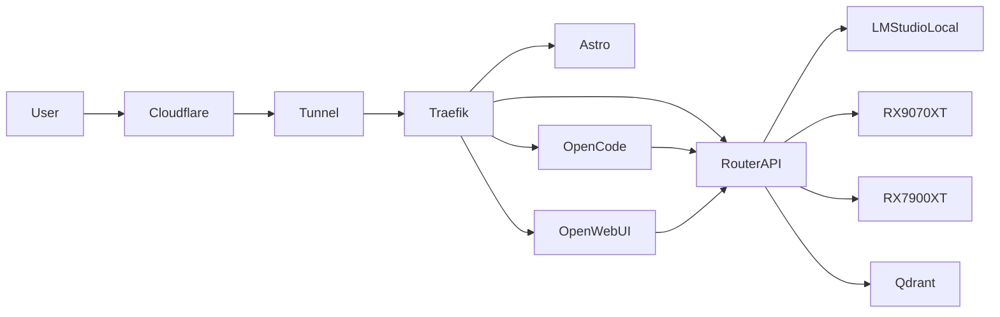

> Documento interno operativo del laboratorio AI-LAB.

---

# Infraestructura Principal

| Servicio | Host | Puerto | Estado |
|---|---|---|---|
| AI-LAB Main Node | 192.168.1.30 | - | ONLINE |
| Main LM Studio | 192.168.1.200 | 1234 | ONLINE |
| GPU Node RX9070XT | 192.168.1.50 | 1234 | ONLINE |
| GPU Node RX7900XT | 192.168.1.60 | 1234 | OFFLINE |
| Router API | 192.168.1.30 | 8008 | ONLINE |
| OpenCode | 192.168.1.30 | 4096 | ONLINE |
| Traefik | 192.168.1.30 | 80/443 | ONLINE |
| Qdrant | 192.168.1.30 | 6333 | ONLINE |
| Open WebUI | 192.168.1.30 | 3000 | ONLINE |
| Portainer | 192.168.1.30 | 9443 | ONLINE |

---

# Router Cognitivo

## Estado

Servicio:

```bash
sudo systemctl status ialab-router-api
```

Restart:

```bash
sudo systemctl restart ialab-router-api
```

Logs:

```bash
journalctl -u ialab-router-api -f
```

Health:

```bash
curl http://127.0.0.1:8008/health
```

Modelos:

```bash
curl http://127.0.0.1:8008/v1/models
```

Test chat:

```bash
curl -s http://127.0.0.1:8008/v1/chat/completions \
  -H "Content-Type: application/json" \
  -d '{
    "model": "ailab-router/auto",
    "messages": [
      {
        "role": "user",
        "content": "di hola"
      }
    ]
  }'
```

---

# OpenCode

## Lanzar OpenCode

```bash
/opt/ai-lab/runtime/opencode_ui.sh
```

## Matar proceso

```bash
pkill -f opencode
```

## Ver proceso

```bash
ps aux | grep opencode
```

## Acceso web

```text
http://192.168.1.30:4096
```

---

# LM Studio

## Endpoint REST

```text
http://IP:1234
```

## Ver modelos

```bash
curl http://192.168.1.200:1234/v1/models
```

## Test chat directo

```bash
curl -s http://192.168.1.200:1234/v1/chat/completions \
  -H "Content-Type: application/json" \
  -d '{
    "model": "google/gemma-4-e4b",
    "messages": [
      {
        "role": "user",
        "content": "hola"
      }
    ]
  }'
```

---

# Snapshot Runtime

## Generar snapshot

```bash
sudo systemctl restart ialab-live-state
```

## Ver snapshot actual

```bash
cat /opt/ai-lab-data/snapshots/current/system_snapshot.json | jq
```

## Ver estado LLM

```bash
cat /opt/ai-lab-data/snapshots/current/system_snapshot.json | jq '.llm'
```

---

# Docker

## Contenedores

```bash
docker ps
```

## Redes

```bash
docker network ls
```

## Reiniciar Traefik

```bash
docker restart traefik
```

---

# Traefik

## Dashboard

```text
http://192.168.1.30:8080
```

## Configuración

```text
/opt/ai-lab/stacks/traefik/docker-compose.yml
```

## Reiniciar stack

```bash
cd /opt/ai-lab/stacks/traefik
docker compose up -d
```

---

# Cloudflare Tunnel

## Estado

```bash
systemctl status cloudflared
```

## Logs

```bash
journalctl -u cloudflared -f
```

---

# Astro / ialab-docs

## Desarrollo

```bash
npm run dev -- --host
```

## Build

```bash
npm run build
```

## Reiniciar docs

```bash
sudo systemctl restart ialab-docs
```

## Logs

```bash
journalctl -u ialab-docs -f
```

---

# Git

## Snapshot rápido

```bash
git add .
git commit -m "snapshot"
```

## Estado

```bash
git status
```

---

# Arquitectura Operativa



---

# Estado Actual del LAB

- Main LM Studio operativo
- Router OpenAI-compatible funcional
- OpenCode operativo
- Traefik + Cloudflare activos
- Observabilidad viva
- Arquitectura distribuida parcial
- RX9070XT pendiente de estabilización
- RX7900XT apagado

---

# TODO

- Failover inteligente real
- Auto healthcheck por request
- Métricas Prometheus
- Grafana NOC
- Routing cognitivo avanzado
- Persistencia de memoria
- Multi-agent runtime
- Balanceo automático GPU
