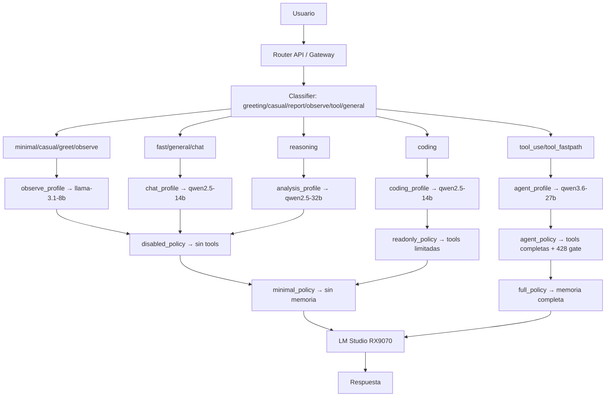

El Routing Cognitivo es el sistema de decisión central del AI-LAB.

Su función es determinar:

- qué modelo usar
- qué GPU utilizar
- cómo distribuir inferencia
- qué contexto recuperar
- cuándo usar grounding
- cómo optimizar recursos

---

# Objetivos

## Optimización de inferencia

Seleccionar automáticamente:

- nodo menos cargado
- GPU óptima
- modelo adecuado
- tamaño de contexto correcto

---

# Flujo conceptual

## Perfiles por ruta

| Ruta | Perfil | Modelo | Tools | Memoria |
|------|--------|--------|-------|---------|
| minimal/casual/greeting/observe | observe | llama-3.1-8b | disabled | minimal |
| fast/general/chat | chat | qwen2.5-14b | disabled | light |
| coding | coding | qwen2.5-14b | readonly | light |
| reasoning | analysis | qwen2.5-32b | disabled | full |
| tool_use/tool_fastpath | agent | qwen3.6-27b | agentic | full |
