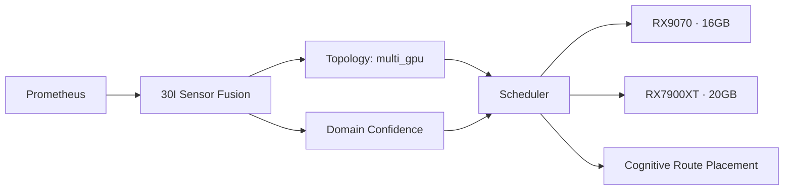

## Checkpoint

**CP-30I-RUNTIME-SENSOR-FUSION-STABLE**

## Visión general

FASE 30I completa la transición de **prompt grounding sintético** a **evidence-backed observacional**. El runtime ya no construye `OBSERVED_RUNTIME` con defaults hardcoded o heurísticas: consulta Prometheus en vivo, fusiona sensores de 13 dominios, clasifica topology, calcula confidence por dominio y entrega un snapshot verificado al LLM.

```
Antes (FASE 30H):
- OBSERVED_RUNTIME construido desde runtime_state + topology
- Evidencia sintética (valores por defecto)
- Sin métricas de GPU en vivo
- Sin detección de cambios en infraestructura

Después (FASE 30I):
- OBSERVED_RUNTIME enriquecido con sensor fusion
- Prometheus como source of truth primario
- GPU metrics en vivo (temp, load, power, fan)
- 13 dominios observados con confidence scoring
- Topología derivada de sensores reales
- Cache TTL 5s con freshness labels
```

## El cambio conceptual

### Antes: prompt grounding

El runtime inyectaba contexto basado en archivos de configuración estáticos. El LLM recibía una descripción del laboratorio que podía estar desactualizada. Si alguien cambiaba un servicio o una GPU, el runtime no lo sabía hasta que se actualizaba el archivo.

### Ahora: evidencia viva

El runtime consulta Prometheus cada 2s (timeout), detecta targets up/down, extrae métricas de GPU, verifica modelos en LM Studio, clasifica la topología y construye un snapshot de 13 dominios con confidence scoring. El LLM recibe datos actuales.

### La diferencia clave

| Aspecto | Prompt Grounding | Sensor Fusion |
|---------|-----------------|---------------|
| Fuente | Archivos estáticos | Prometheus API viva |
| GPU metrics | No disponibles | Temp, load, power, fan, clock, voltage |
| Topología | Hardcoded | Detectada dinámicamente |
| Confidence | No existe | Per-domain (CRITICAL/IMPORTANT/AUXILIARY) |
| Cache | Ninguno | TTL 5s con freshness |
| Staleness | Indetectable | Freshness labels por sensor |

## Arquitectura

### Componentes

```
runtime/context/prometheus_client.py     ← PrometheusQueryClient
runtime/context/sensor_fusion.py          ← SensorFusionEngine
runtime/context/summary_builder.py        ← OperationalSummaryBuilder
runtime/context/report_runtime_context.py ← integración OBSERVED_RUNTIME
runtime/gateway/openai_gateway.py         ← endpoint /runtime/sensors
runtime/telemetry/prometheus_metrics.py   ← 4 métricas sensor fusion
```

### Pipeline de datos

```mermaid
flowchart LR
    P[Prometheus<br/>192.168.1.40:9090] --> QC[PrometheusQueryClient]
    QC --> SF[SensorFusionEngine]
    LM[LM Studio<br/>192.168.1.50:1234] --> SF
    
    SF --> SNAPSHOT[RuntimeSensorFusionSnapshot]
    SF --> TOPO[RuntimeTopologyState]
    SF --> CONF[Domain Confidence<br/>13 dominios]
    SF --> EVIDENCE[Evidence Catalog<br/>observed vs derived]
    
    SNAPSHOT --> SB[OperationalSummaryBuilder]
    SB --> SUMMARY[Route-family-aware<br/>summary]
    
    SNAPSHOT --> RRC[report_runtime_context.py]
    SUMMARY --> RRC
    RRC --> OBSERVED[OBSERVED_RUNTIME<br/>≤16KB]
    OBSERVED --> LLM[qwen2.5-14b]
    
    GATEWAY[Gateway<br/>:8008] --> ENDPOINT[/runtime/sensors]
    SNAPSHOT --> ENDPOINT
```

## Los 13 dominios observados

Cada dominio tiene `source_of_truth`, confidence level y freshness label.

| # | Dominio | SensorPriority | source_of_truth |
|---|---------|---------------|-----------------|
| 1 | gateway | CRITICAL | prometheus |
| 2 | router | CRITICAL | prometheus |
| 3 | gpu_nodes | CRITICAL | prometheus |
| 4 | control_plane | IMPORTANT | prometheus |
| 5 | live_api | IMPORTANT | prometheus |
| 6 | system_node | IMPORTANT | prometheus |
| 7 | smartctl | IMPORTANT | prometheus |
| 8 | lmstudio_models | IMPORTANT | lmstudio_api |
| 9 | containers | AUXILIARY | prometheus |
| 10 | docker | AUXILIARY | prometheus |
| 11 | windows_exporters | AUXILIARY | prometheus |
| 12 | unifi | AUXILIARY | prometheus |
| 13 | cloudflare_tunnel | AUXILIARY | prometheus |

### SensorPriority

```
CRITICAL  (gateway, router, gpu_nodes)      → failure = degraded state
IMPORTANT (control_plane, live_api, system) → failure = warning
AUXILIARY (unifi, docker, cloudflare)        → failure = logged only
```

## observed vs derived state

Separación estricta entre lo que el runtime observa directamente y lo que infiere:

### observed_data
Datos crudos de Prometheus o APIs directas: target up/down, métricas GPU, modelos disponibles, freshness.

### derived_state
Inferencias del runtime basadas en múltiples observaciones: health score, topology mode, alias normalization, GPU status classification.

```json
{
  "observed_data": {
    "gateway": {
      "source_of_truth": "prometheus",
      "up": true,
      "last_scrape_seconds_ago": 1.2
    },
    "gpu_nodes": {
      "source_of_truth": "prometheus",
      "up": [true, false],
      "gpu_metrics": {
        "rx9070": {"temp": 32.0, "load": 0.0}
      }
    }
  },
  "derived_state": {
    "gateway": {"health": "ok"},
    "gpu_nodes": {
      "health": "ok",
      "active": "RX9070",
      "vram_gb": 16,
      "expected_offline": ["RX7900XT"]
    }
  }
}
```

## Domain confidence model

El confidence es **per-domain**, no global. Un fallo en un sensor AUXILIARY (unifi, docker) NO degrada el confidence de dominios CRITICAL.

| Condición | Confidence |
|-----------|-----------|
| Target UP, scrape reciente (<5s) | high |
| Target UP, scrape stale (5-30s) | medium |
| Target DOWN, expected_offline | medium |
| Target DOWN, unexpected | low |
| Sin datos (timeout) | none |

## Topología derivada de sensores

La topología ya no es un archivo estático. Se deriva de los targets de Prometheus:

| Targets UP | Targets DOWN (unexpected) | Topology mode |
|------------|--------------------------|---------------|
| gateway + 1 GPU | 0 | single_gpu |
| gateway + 1 GPU | 1 (expected_offline) | degraded_single_gpu |
| gateway + 0 GPU | 1+ | inventory_only |
| gateway + 2+ GPU | 0 | multi_gpu |

### Estado actual

```json
{
  "mode": "degraded_single_gpu",
  "active_gpus": [{
    "name": "RX9070",
    "host": "192.168.1.50",
    "vram_gb": 16,
    "status": "online",
    "gpu_temp_c": 32.0,
    "gpu_load_pct": 0.0,
    "gpu_power_w": 49.0,
    "gpu_fan_rpm": 950.0
  }],
  "inventory_gpus": [{
    "name": "RX7900XT",
    "host": "192.168.1.60",
    "vram_gb": 20,
    "status": "offline",
    "expected_offline": true
  }],
  "unexpected_down": []
}
```

## GPU dynamic metric discovery

El `PrometheusQueryClient` descubre dinámicamente métricas de GPU desde el endpoint `9183`:

| Métrica | Descripción |
|---------|-------------|
| `gpu_smalldata` | Datos pequeños GPU |
| `gpu_load_percent` | Carga GPU (%) |
| `gpu_temperature_celsius` | Temperatura (°C) |
| `gpu_power_watts` | Consumo (W) |
| `gpu_fan_speed_rpm` | Ventilador (RPM) |
| `gpu_clock_mhz` | Frecuencia (MHz) |
| `gpu_voltage` | Voltaje (V) |

### Prefix deduplication

Los nombres de métricas GPU que comienzan con "GPU" tienen su prefijo `gpu_` deduplicado automáticamente para evitar `gpu_gpu_memory_used`.

## Endpoint /runtime/sensors

Always-on 200. Devuelve el snapshot completo del sensor fusion:

```json
{
  "status": "ok",
  "service": "ai-lab-openai-gateway",
  "endpoint": "runtime/sensors",
  "timestamp": 1779365626.0,
  "topology": { "...": "..." },
  "observed_sources": ["gpu_nodes", "gateway", "router", ...],
  "missing_sources": [],
  "expected_offline": ["RX7900XT"],
  "unexpected_down": [],
  "domain_confidence": {
    "gateway": "high",
    "router": "high",
    "gpu_nodes": "high",
    "control_plane": "high",
    ...
  },
  "gpu_summary": "RX9070: 16GB VRAM, 0% load, 32°C, 49W, fan 950RPM | RX7900XT: 20GB VRAM, offline (inventory)",
  "derived_state": {
    "gpu_nodes": {"health": "ok", "active": "RX9070", "vram_gb": 16},
    "gateway": {"health": "ok"},
    "control_plane": {"health": "ok", "expected": true}
  },
  "freshness": {
    "gateway": "1.2s ago",
    "gpu_nodes": "1.5s ago",
    ...
  }
}
```

## Integración en OBSERVED_RUNTIME

`report_runtime_context.py` enriquece el snapshot del runtime con:

- `sensor_snapshot` — datos observados de 13 dominios
- `runtime_topology` — topología derivada de sensores
- `domain_confidence` — confidence por dominio
- `evidence_catalog` — catálogo de lo observado
- `operational_summary` — resumen route-family-aware

Límite: 16 KB (REPORT_MAX_CHARS=16000).

### Route-family-aware summaries

| Route family | Contenido del summary |
|-------------|----------------------|
| minimal | Solo gpu_summary |
| report | Completo: gpu + routing + slo + storage + identity |
| cognitive | Identity + routing + slo + gpu |

## Métricas Prometheus (4 nuevas)

| Métrica | Tipo | Descripción |
|---------|------|-------------|
| `ailab_sensor_fusion_total` | Counter | Colecciones de sensor fusion por source y status |
| `ailab_sensor_fusion_duration_ms` | Histogram | Duración de sensor fusion por source |
| `ailab_sensor_fusion_missing_source_total` | Counter | Sources missing durante colección |
| `ailab_observed_runtime_context_size_bytes` | Gauge | Tamaño del snapshot OBSERVED_RUNTIME |

## Estado de Prometheus

17 targets configurados en `192.168.1.40:9090`, 15 UP, 2 DOWN (RX7900XT expected).

| Target | Endpoint | Estado |
|--------|----------|--------|
| ai-lab-gateway | 192.168.1.30:8008/metrics | UP |
| ai-lab-router | 192.168.1.30:8083/metrics | UP |
| ai-lab-live-api | 192.168.1.30:8084/metrics | UP |
| ai-lab-gpu-rx9070 | 192.168.1.50:9182 | UP |
| ai-lab-gpu-metrics | 192.168.1.50:9183 | UP |
| ai-lab-node | 192.168.1.30:9100 | UP |
| ai-lab-cadvisor | 192.168.1.30:8081 | UP |
| cloudflare-tunnel | tunnel:2000 | UP |
| ai-lab-gpu-rx7900xt | 192.168.1.60:9182 | DOWN (expected) |
| ai-lab-gpu-metrics | 192.168.1.60:9183 | DOWN (expected) |

## Conexión con fases anteriores

### FASE 30H — Evidence Enforcement

30H construyó el evidence guard con denylists y sanitización post-hoc. Pero dependía de un OBSERVED_RUNTIME sintético (construido desde archivos de estado).

30I reemplaza la fuente de ese OBSERVED_RUNTIME: ahora es Prometheus-backed. El evidence guard sigue siendo la capa de sanitización, pero recibe datos reales en lugar de defaults.

```
30H: evidence_guard(respuesta_llm, OBSERVED_RUNTIME_sintético)
30I: evidence_guard(respuesta_llm, OBSERVED_RUNTIME_de_prometheus)
```

### FASE 30A — Runtime State Foundation

30A introdujo `runtime_generation` y `TemporalState`. 30I añade `sensor_generation` y freshness labels que complementan los descriptores de madurez.

### FASE 30D — Topology & Failure Domain

30D definió la taxonomía de dominios de fallo. 30I implementa la topología derivada de sensores, haciendo que la clasificación de dominios de fallo sea dinámica.

## Lo que viene: Multi-GPU

FASE 30I es el prerequisito observacional para Multi-GPU (FASE 31A):

| Capacidad | 30I provee |
|-----------|------------|
| Detección de nodos GPU | Dynamic metric discovery + target health |
| Clasificación offline/online | expected_offline vs unexpected_down |
| Topología dinámica | mode cambia según targets UP |
| Confidence routing | SensorPriority para decisiones de scheduling |
| GPU metrics en vivo | Temp, load, power, fan para warm pool |

### Escenario multi-GPU futuro



Con 30I, el scheduler multi-GPU no necesitará archivos de configuración: leerá la topología directamente de Prometheus.

## Tests

29 tests en `tests/test_runtime_sensor_fusion_30i.py`:

| Test suite | Tests | Descripción |
|-----------|-------|-------------|
| PrometheusQueryClient | 8 | Query, timeout, cache TTL, GPU metrics, freshness |
| SensorFusionEngine | 9 | Collect, domains, observed/derived, confidence, topology |
| RuntimeTopologyState | 2 | Dict serialization, inventory-only mode |
| OperationalSummaryBuilder | 6 | Build, minimal, GPU summary, routing, SLO, storage |
| Integration | 4 | Snapshot keys, observed sources, GPU metrics |

## Burn-in evidence

### Request de prueba

```json
POST /v1/chat/completions
{
  "model": "qwen/qwen2.5-coder-14b-instruct",
  "messages": [{"role": "user", "content": "What is the current GPU temperature and which GPUs are available?"}],
  "max_tokens": 150
}
```

### Respuesta observada

El LLM reportó datos reales:
- RX9070: 32°C, 0% load, 49W, fan 949 RPM
- RX7900XT: offline, expected to be offline

Prompt tokens: 2621 (vs ~1200 pre-30I, indicando inyección de OBSERVED_RUNTIME).
OBSERVED_RUNTIME size: 4043 bytes (bajo límite 16KB).

### Sin alucinaciones

No se observaron:
- NVIDIA A100/H100 (presentes en training data)
- GPT-4, Claude, Gemini
- AWS, GCP, Azure
- Kubernetes, Docker Swarm

## Lessons learned

### Los modelos no ven metadata privada

Los LLMs solo reciben `messages[]`. No pueden acceder a archivos, variables de entorno, APIs internas o estado del sistema. Todo lo que necesitan saber debe estar explícitamente en el prompt.

### Importancia de OBSERVED_RUNTIME

Sin un snapshot explícito del runtime, el LLM rellena con training data. Para un informe de infraestructura, eso significa NVIDIA A100, AWS, Kubernetes — lo que sea más probable estadísticamente.

### Límites del evidence guard sintético

El evidence guard de 30H funcionaba, pero sobre datos sintéticos. Un OBSERVED_RUNTIME desactualizado producía falsos positivos (marcar como no verificado algo que sí existía pero no estaba en el snapshot). 30I resuelve esto con datos vivos.

### Prometheus como source of truth

Prometheus no es solo para dashboards. Es el sistema nervioso del runtime: todo lo que el runtime necesita saber sobre su propia infraestructura está en Prometheus. El LLM no necesita adivinar.

### Cache vs freshness

TTL de 5s es suficiente para un runtime que recibe requests cada 10-30s. Pero el sistema de freshness labels permite detectar cuándo un dato es stale sin bloquear la respuesta.

## Ver también

- [Runtime Observability Fabric](/docs/architecture/runtime-observability-fabric/)
- [Runtime Sensor Topology](/docs/architecture/runtime-sensor-topology/)
- [Runtime Evidence Pipeline](/docs/architecture/runtime-evidence-pipeline/)
- [Evidence Enforcement (FASE 30H)](/docs/governance/evidence-enforcement/)
- [Runtime Trust Boundaries](/docs/governance/runtime-trust-boundaries/)
- [Prometheus Runtime Integration](/docs/observability/prometheus-runtime-integration/)
- [Runtime Sensor Fusion — Observability](/docs/observability/runtime-sensor-fusion/)
- [30I Burn-in Results](/docs/experiments/30i-burnin-results/)
