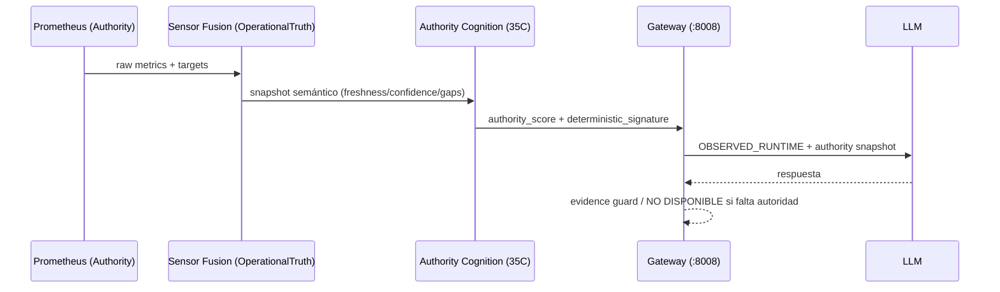

# Authority-Backed Cognition (35C)

AI-LAB separa dos cosas:

- **Authority**: qué está pasando ahora (datos observados).
- **Cognition**: cómo responder/razonar sin inventar infraestructura.

En 35C se endurece el principio: **la cognición solo es válida si está respaldada por autoridad**.

## Flujo de autoridad

## Reglas

- Si la autoridad es `stale/unavailable`, la respuesta debe evitar afirmaciones operativas.
- El runtime puede responder con `NO DISPONIBLE` si falta evidencia.
- La autoridad es por dominio (no un único “health score”).

## Señales visibles

- Endpoint: `GET /runtime/authority/score`.
- Campos típicos: freshness score, gaps, deterministic signature.

## Anti-pitfalls

- **Discoverable != operational**: que un modelo aparezca en discovery no lo vuelve operativo.
- GitNexus/memory nunca sustituyen Prometheus como autoridad.
