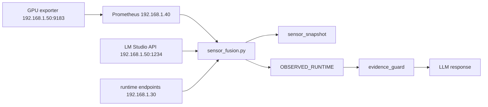

## Alcance

FASE 30I introduce una capa nueva: `sensor_fusion.py` como punto de convergencia entre métricas Prometheus, estado LM Studio y topología operativa.

FASE 30I-B endurece esa capa con:

- fixes de dataclasses
- métricas de observabilidad del propio sensor fusion
- ampliación de tests
- validación de fallback y edge cases

## Qué resuelve

- pasar de topología estática a topología observada
- separar `observed_data` de `derived_state`
- modelar `expected_offline`
- evitar que una GPU inventariada degrade la confianza crítica del runtime

## Dominios observados

13 dominios:

- `gateway`
- `router`
- `gpu_nodes`
- `control_plane`
- `live_api`
- `containers`
- `docker`
- `system_node`
- `smartctl`
- `lmstudio_models`
- `windows_exporters`
- `unifi`
- `cloudflare_tunnel`

## Pipeline

## Topología derivada

Caso actual:

- `topology_mode = degraded_single_gpu`
- RX9070 activa
- RX7900XT inventariada / expected offline

No es un fallo crítico. Es una condición operacional conocida.

## Hardening 30I-B

30I-B corrige y valida:

- `stale_sources`
- `_gpu_metrics_cache`
- `_global_confidence`
- comparación correcta de `expected_offline_targets`
- registro de métricas de duración y missing sources
- ampliación de suite a más de 50 tests

## Resultado

30I + 30I-B dejan listo el baseline del runtime observacional sobre el que se apoyan 30I-C y 30I-D.
