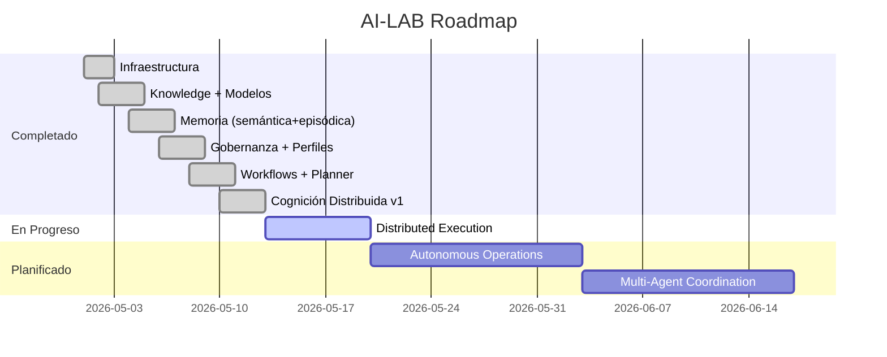

# AI-LAB: ARQUITECTURA GENERAL
## Local-First Distributed Cognitive Infrastructure v1

---

## 1. VISIÓN GENERAL

AI-LAB es una plataforma cognitiva operacional local-first diseñada para homelab, inferencia distribuida y automatización inteligente de infraestructura. Su núcleo es un **Distributed Cognitive Runtime** que orquesta la ejecución de modelos de IA a través de un clúster heterogéneo de nodos.

## 2. PRINCIPIOS DE DISEÑO

| Principio | Descripción |
|-----------|-------------|
| **Local First** | Todo ejecuta local, privado, auto-gestionado y soberano. Sin dependencia cloud. |
| **Modular** | Separación explícita entre cognición, memoria, ejecución, gobernanza, workflows, orquestación e infraestructura. |
| **Crecimiento Incremental** | Evolución por capas progresivas: infraestructura → conocimiento → memoria → gobernanza → workflows → cognición distribuida → operaciones autónomas. |

## 3. DIAGRAMA DE ARQUITECTURA

```
┌─────────────────────────────────────────────────────────────────────┐
│                        USER INTERFACE                                 │
│            Open WebUI (3000) │ Router API (8000) │ CLI                │
└──────────────────────────────┬──────────────────────────────────────┘
                               │
                               ▼
┌──────────────────────────────────────────────────────────────────────┐
│                        COGNITIVE RUNTIME                              │
│                                                                       │
│  ┌──────────────┐  ┌──────────────┐  ┌───────────────────────────┐   │
│  │ Intent Router │─▶│ Workflow     │─▶│ Distributed Task Router   │   │
│  │ (clasifica)   │  │ Planner      │  │ (asigna nodo + capacidad) │   │
│  └──────────────┘  └──────────────┘  └───────────┬───────────────┘   │
│                                                   │                   │
│  ┌──────────────┐  ┌──────────────┐              ▼                   │
│  │ Governance   │  │ Profiles     │  ┌───────────────────────────┐   │
│  │ (audit/perm) │  │ (sb/pilot/pr)│  │ Execution Coordinator     │   │
│  └──────────────┘  └──────────────┘  │ (sandbox_runner + valid)  │   │
│                                       └───────────┬───────────────┘   │
│  ┌──────────────┐  ┌──────────────┐              │                   │
│  │ Semantic     │  │ Episodic     │              ▼                   │
│  │ Memory       │  │ Memory       │  ┌───────────────────────────┐   │
│  │ (Qdrant)     │  │ (JSONL)      │  │ Inference Nodes           │   │
│  └──────────────┘  └──────────────┘  │ Ollama + LM Studio × 3    │   │
│                                       └───────────────────────────┘   │
└──────────────────────────────────────────────────────────────────────┘
                               │
                               ▼
┌──────────────────────────────────────────────────────────────────────┐
│                    INFRASTRUCTURE LAYER                                │
│                                                                       │
│  ┌──────────────┐  ┌──────────────┐  ┌───────────────────────────┐   │
│  │ Docker       │  │ Traefik      │  │ Samba (SMB) / SSH          │   │
│  │ (5 servicios)│  │ (proxy)      │  │ (acceso a nodos)           │   │
│  └──────────────┘  └──────────────┘  └───────────────────────────┘   │
│                                                                       │
│  ┌──────────────┐  ┌──────────────┐  ┌───────────────────────────┐   │
│  │ ubuntu-ialab │  │ RX7900XT (.60)│  │ RX9070 (.50) │ NAS (.250) │   │
│  │ Orquestador  │  │ Reasoning     │  │ Multimodal    │ Ligero     │   │
│  └──────────────┘  └──────────────┘  └───────────────────────────┘   │
└──────────────────────────────────────────────────────────────────────┘
```

## 4. CAPAS DEL SISTEMA

### 4.1. Capa de Infraestructura
- 1 nodo orquestador (Ubuntu 26.04, Hyper-V)
- 3 nodos de inferencia (NAS + 2 GPU)
- Red local 192.168.1.0/24, latencias <1ms
- Samba para compartición de archivos
- SSH para gestión remota de nodos Windows

### 4.2. Capa de Contenedores (Docker)
| Servicio | Imagen | Puerto | Función |
|----------|--------|--------|---------|
| Traefik | traefik:latest | 80/443/8080 | Proxy inverso |
| Open WebUI | open-webui:main | 3000 | Frontend IA unificado |
| Ollama | ollama:latest | 11434 | Inferencia CPU local |
| Qdrant | qdrant:latest | 6333 | Base de datos vectorial |
| Portainer | portainer-ce:latest | 9000 | Gestión Docker |

### 4.3. Capa de Inferencia Distribuida
- **Ollama** (CPU local): modelos ligeros, embeddings, fallback
- **LM Studio** (GPU externa): modelos pesados vía API OpenAI-compatible
- Tres nodos backend independientes con capacidades distintas

### 4.4. Capa de Runtime Cognitivo (Python)
25 módulos organizados en:
- `agent/` — Enrutamiento de intenciones, contexto selectivo
- `distributed/` — Routing y coordinación distribuida
- `execution/` — Ejecución con sandbox y validación
- `memory/` — Memoria semántica (Qdrant) + episódica (JSONL)
- `nodes/` — Registro, healthcheck y scheduler de nodos
- `planner/` — Planificación de tareas y herramientas
- `profiles/` — Perfiles de gobernanza (sandbox/pilot/production)
- `policies/` — Políticas de ejecución
- `security/` — Guard de capacidades
- `workflows/` — Motor de workflows
- `llm/` — Router API FastAPI, invocación de modelos
- `state/` — Estado del sistema (Docker, LM Studio, GPU)
- `rag/` — Pipeline RAG local

### 4.5. Capa de Gobernanza
- 3 perfiles operacionales con restricciones progresivas
- 4 modos de operación (readonly/plan/build/execute)
- Audit trail persistente (governance_audit.jsonl)
- Capability enforcement en 3 niveles

## 5. CICLO DE VIDA DE UNA PETICIÓN

```
1. Usuario envía petición a Open WebUI o Router API
2. Intent Router clasifica la intención (coding/reasoning/fast/vision...)
3. Workflow Planner genera plan de tareas
4. Distributed Task Router selecciona nodo óptimo por capacidades
5. Execution Coordinator valida contra perfil de gobernanza
6. Nodo seleccionado ejecuta inferencia (Ollama o LM Studio)
7. Resultado se registra en memoria episódica + audit trail
8. Respuesta retorna al usuario
```

## 6. FLUJO DE DATOS

```
                    ┌──────────────────┐
                    │    Memoria       │
                    │    Semántica     │
                    │    (Qdrant)      │◀────────┐
                    └──────────────────┘         │
                          ▲                      │
                          │ consulta             │ indexación
                    ┌──────────────────┐         │
                    │  Embedding       │─────────┘
                    │  Pipeline        │
                    └──────────────────┘
                          ▲
                          │ genera embedding
                    ┌──────────────────┐
                    │  Archivos .md    │
                    │  Documentación   │
                    │  Conocimiento    │
                    └──────────────────┘

                    ┌──────────────────┐
                    │  Memoria         │
                    │  Episódica       │
                    │  (JSONL)         │◀─── audit_event()
                    └──────────────────┘      write_episode()
                          ▲
                          │ eventos
                    ┌──────────────────┐
                    │  Governance      │
                    │  Audit Trail     │
                    └──────────────────┘
```

## 7. EVOLUCIÓN DEL PROYECTO



## 8. TECNOLOGÍAS CLAVE

| Categoría | Tecnología | Versión |
|-----------|-----------|---------|
| OS | Ubuntu Server | 26.04 LTS |
| Contenerización | Docker + Docker Compose | 5.1.3 |
| Proxy | Traefik | 3.7.0 |
| Frontend IA | Open WebUI | main |
| Inferencia CPU | Ollama | latest |
| Inferencia GPU | LM Studio | latest |
| Vector DB | Qdrant | 1.18.0 |
| Embeddings | sentence-transformers | all-MiniLM-L6-v2 |
| API Runtime | FastAPI (Python) | 3.14 |
| Gobernanza | Governance Runtime | v1 |
| Routing | Distributed Cognitive Router | v1 |
| Workflows | Cognitive Workflow Engine | v1 |
